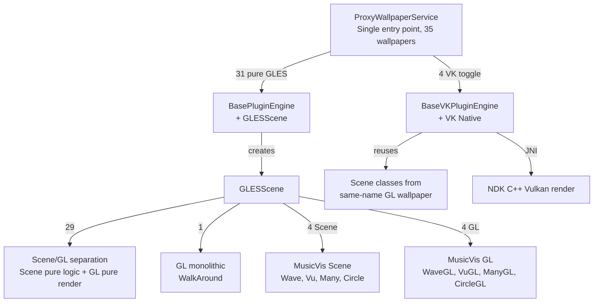
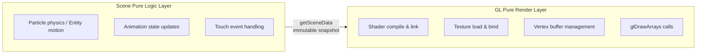
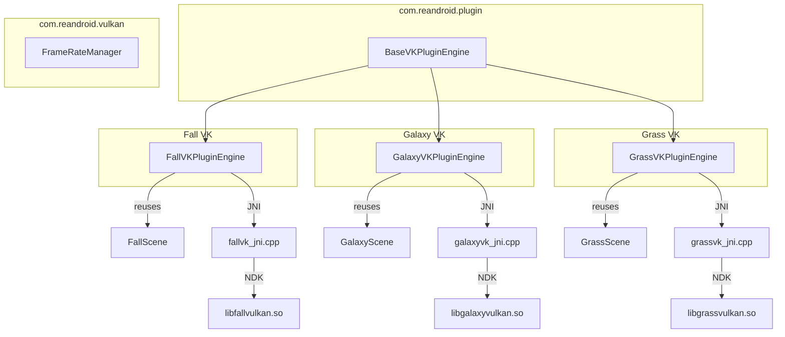

# Architecture

> This is the expanded developer documentation from the [README](README-en.md).
> For installation, configuration and FAQ see the README; for the rules to follow when
> contributing see [CONTRIBUTING.md](CONTRIBUTING.md) (Chinese).

## Core Architecture

### Three-Layer Plugin Interface

Each wallpaper implements three interfaces, with lifecycle driven by ProxyWallpaperService:

```
WallpaperPlugin          → Plugin factory: getId() / createEngine() / release()
WallpaperEngine          → Render engine: onCreate() / drawFrame() / onSurfaceChanged() / onTouchEvent() ...
WallpaperPluginHost      → Host service: getSharedPreferences() / getContext() / requestRender()
```

- **WallpaperPlugin** — No-arg constructor, instantiated by ProxyWallpaperService via `Class.forName()` reflection
- **WallpaperEngine** — Manages its own EGL/Vulkan context, receives all Surface lifecycle callbacks
- **WallpaperPluginHost** — Provides `plugin_{id}` isolated SharedPreferences and ApplicationContext

### ProxyWallpaperService Dispatch Logic

```
User selects wallpaper → setActivePlugin(ctx, pluginId) → writes to proxy_wallpaper prefs
System creates wallpaper → ProxyWallpaperService.onCreateEngine()
  → reads pluginId
  → opens assets/{pluginId}/info.json → reads plugin class name
  → checks plugin_{pluginId} prefs for use_vulkan toggle
  → if VK=true and info.json has pluginVk field → uses VK class name
  → Class.forName() instantiates WallpaperPlugin
  → plugin.createEngine(context, host) creates WallpaperEngine
  → ProxyEngine forwards all Surface callbacks to WallpaperEngine
```

### Language Resource Resolution Chain

Control label translations in settings pages come from `assets/{pluginId}/language/{locale}.json`, with resolution priority:

1. Full locale tag (e.g., `zh-rCN`) → `PluginResources.loadLanguage(ctx, pluginId, "zh-rCN")`
2. Language code only (e.g., `zh`) → `loadLanguage(ctx, pluginId, "zh")`
3. Default English → `loadLanguage(ctx, pluginId, "default")`

The `title`/`summary` fields in `layout.json` store **language JSON lookup keys** (e.g., `"pref_grass_enabled"`), not display text, and not `@string/` references. `DynamicPreferenceFactory` calls `resolveLang()` to check the language JSON first, then `resolveStringRef()` as a fallback for any remaining `@string/` references.

### info.json Schema

Located at `assets/{pluginId}/info.json`:

```json
{
  "label": "@string/wallpaper_xxx",
  "plugin": "com.reandroid.wallpaper.xxx.XxxPlugin",
  "pluginVk": "com.reandroid.wallpaper.xxx.XxxVKPlugin",
  "previewClass": "com.reandroid.wallpaper.xxx.XxxGL",
  "permissions": ["ACCESS_FINE_LOCATION", "CAMERA"],
  "useLegacySettings": false
}
```

| Field | Required | Description |
| --- | --- | --- |
| `label` | ✓ | Wallpaper display name (can reference `@string/`) |
| `plugin` | ✓ | GLES plugin fully-qualified class name |
| `pluginVk` | | Vulkan plugin fully-qualified class name (when present, VK toggle appears in settings) |
| `previewClass` | | Class for the real-time preview in settings — a GL class, or a Scene class (vis2/vis3 point straight at their Scene) |
| `permissions` | | Runtime permission list, API constant names |
| `hidden` | | `true` hides it from the settings list, and `assembleRelease` leaves the assets out of the APK |
| `fragment` | | Fragment class for the legacy settings screen (used when `plugin` is absent) |
| `useLegacySettings` | | `true` skips the plugin settings path and uses `fragment` instead. **No wallpaper sets this today** (PolarClock did once, and has since moved to the plugin path) |

### layout.json Schema

Located at `assets/{pluginId}/layout.json`:

```json
{
  "prefs": [
    {
      "type": "switch",
      "key": "pref_xxx_enabled",
      "title": "pref_xxx_enabled",
      "summary": "pref_xxx_desc",
      "default": true,
      "min": 0, "max": 100,
      "values": ["a", "b"],
      "labels": ["A", "B"],
      "dependency": "parent_key",
      "disableOn": "parent_key",
      "action": "pickBackground"
    }
  ]
}
```

| Field | Applies To | Description |
| --- | --- | --- |
| `type` | All | `switch` / `seekbar` / `list` / `color` / `button` |
| `key` | All | SharedPreferences key name |
| `title` | All | Language JSON lookup key |
| `summary` | All | Language JSON lookup key (optional) |
| `default` | All | Default value (switch: bool, seekbar/list: number or string) |
| `min`, `max` | seekbar | Value range |
| `values` | list | Stored value array |
| `labels` | list | Display label array (can use `@string/` references; also supports `{key}_label_{value}` pattern) |
| `dependency` | All | Only enabled when parent switch is true |
| `disableOn` | All | Disabled when parent switch is true (opposite of dependency) |
| `action` | button | `pickBackground` (image picker) or `resetBackground` (restore default) |

### Package Structure

```
com.reandroid
├── gles/           GLESWallpaper / GLESScene / GLESPreviewView
├── plugin/         ProxyWallpaperService / BasePluginEngine / BaseVKPluginEngine
│                   WallpaperPlugin / WallpaperEngine / WallpaperPluginHost
│                   PluginSettingsFragment / PluginResources / DynamicPreferenceFactory
├── vulkan/         VKWallpaperEngine / VKSurfaceView / FrameRateManager
├── utils/          AssetLoader / GLTextureUtils / MathUtils / RawResourceLoader
├── settings/       SettingsActivity / SettingsMainFragment / PluginSettingsActivity
│                   PreviewPreference / WallpaperSettings / MiuiPermissionHelper
├── weather/        WeatherManager / WeatherCondition / WeatherState
├── update/         UpdateHelper / UpdateChecker / UpdateDownloader / VersionInfo
└── wallpaper/      35 Plugin + 35 Engine + 27 Scene + 30 GL (grouped by subpackage)
    ├── weatherwallpapers/  Ocean / Windmill
    ├── musicvis/           5 music visualization plugins, shared Scene/GL/assets
    └── ......
```

### Render Paths



### Scene/GL Separation Pattern

Almost every wallpaper uses Scene (pure logic) + GL (pure rendering) separation — 33 Scene classes today. The one that does not is `walkaround`: its logic is Camera API plumbing, so moving it into a Scene would still not run on the JVM:

- **Scene class**: `package-private final class`, handles physics, animation state, entity management — zero Android/GL imports
- **GL class**: `public class extends GLESScene`, handles shader compilation, texture loading, draw calls — no business logic
- **Mat4**: Pure Java matrix math (`orthoM`, `frustumM`, `translateM`, `rotateM`, `multiplyMM`) — the same operations as `android.opengl.Matrix` but **not an Android class**, so a Scene that uses it compiles and runs on the JVM for unit tests. Five files use Mat4 today; **ten Scene classes still use `android.opengl.Matrix`** and therefore cannot run on the JVM. Prefer Mat4 in new Scenes



29 Scene/GL separated wallpapers: Aurora1, Aurora2, BlueSea, CosmicFlow, Cube, DeepSea, Droid, Earth, Fall, Fireworks, Forest, Galaxy, Galaxy4, GeekLog, Grass, HoloSpiral, LuminousDots, MagicSmoke, Microbes, Nexus, NightSky, NixieTube, NoiseField, Ocean, PhaseBeam, PolarClock, Silk, WildWorld, Windmill

4 MusicVis Scene classes shared by 5 plugins: WaveScene (vis2 FFT + vis3 PCM), VuScene (vis4), ManyScene (vis5 → WaveScene + VuScene combo), CircleScene (vis6)

1 GL monolithic wallpaper: WalkAround (camera passthrough — no extractable logic)

### Preference Injection

The plugin engine injects `plugin_{id}` isolated SharedPreferences into Scene objects via reflection:

1. `BasePluginEngine.tryInjectPrefs()` / `BaseVKPluginEngine` constructor
2. Calls `scene.setPluginPrefs(SharedPreferences)` via reflection
3. `WallpaperSettings.getXxx()` inside Scene prioritizes the injected prefs
4. ProGuard rules keep the `setPluginPrefs` method from being obfuscated

### GLES Render Engine

BasePluginEngine encapsulates EGL context management and **deferred initialization**:

```
onSurfaceChanged (main thread)
  → only stores surface / resources / preview to pending fields
  → mSceneInitPending = true

first drawFrame (render thread, EGL already current)
  → if mSceneInitPending:
      → mScene.init(surface, resources, preview)  // GL commands safe to execute
      → mScene.resize(width, height)
      → mScene.start()
      → mSceneInitPending = false
```

This solves the problem where `onSurfaceChanged` is called on the main thread but GL operations must execute on the render thread.

### Vulkan Path

4 wallpapers (Fall, Galaxy, Galaxy4, Grass) provide Vulkan backends, implementing `WallpaperEngine` + `Runnable` via `BaseVKPluginEngine`, with self-managed render threads. They reuse the Scene pure logic classes from their GL counterparts.



- `BaseVKPluginEngine` (`com.reandroid.plugin`) encapsulates thread management, Surface lifecycle, frame rate diagnostics
- Subclasses implement template methods: `createRenderer()`, `destroyRenderer()`, `onSurfaceCreatedNative()`, `renderFrame()`, `uploadTextures()`
- Native code shares infrastructure via [vk_common.h](app/src/main/jni/vk_common.h) CRTP template: 679 + 1176 + 1321 + 1540 = **4,716** lines
- `FrameRateManager` provides shared FPS control and ANR diagnostics (threshold 200ms, stats every 120 frames)
- `vkArgbToRgba()` converts Android ARGB → Vulkan RGBA byte order
- Swapchain format uses UNORM (not SRGB) to avoid double gamma correction

### MusicVis Architecture

5 music visualization plugins share 4 Scene classes and 4 GL classes:

| Plugin | Scene | GL | Audio Mode |
| --- | --- | --- | --- |
| vis2 | WaveScene | MusicVisWaveGL | FFT |
| vis3 | WaveScene | MusicVisWaveGL | PCM |
| vis4 | VuScene | MusicVisVuGL | PCM |
| vis5 | ManyScene (WaveScene + VuScene combo) | MusicVisManyGL | FFT |
| vis6 | CircleScene | MusicVisCircleGL | FFT |

- **AudioVisBase** — Abstract base class managing AudioCapture lifecycle, HSL re-coloring, presets
- **AudioCapture** — Double-buffered Visualizer capture: `mRawBufferA/B` + `mReadyRawBuffer`, capture thread writes, render thread reads, lock-free swap; 3-second idle timeout auto-stop
- **ManyScene** — WaveScene + VuScene instance composition, not inheritance

### Shared Assets

Two cross-wallpaper shared asset directories (not owned by any single wallpaper):

- [assets/musicvis/](app/src/main/assets/musicvis/) — 10 GLSL shaders, 10 textures (VU meter face/frame/needle/peak), 1 quad UV CSV, shared by 5 MusicVis plugins
- [assets/weatherwallpapers/common/drawable/](app/src/main/assets/weatherwallpapers/common/drawable/) — 85 weather textures (cloud/rain/snow/lightning/fog/sun/water droplet animation frame sequences), shared by Ocean + Windmill

### Settings System

`SettingsActivity` unified entry → 2-column grid wallpaper list (auto-discovered from `assets/*/info.json`) → generic `PluginSettingsFragment` (driven by `layout.json`).

- Real-time preview / Vulkan toggle / custom background / dependency & mutual exclusion / restore defaults
- Global framerate (overflow menu → 8 options) / preview aspect ratio / Reset All
- Weather button (tap for PopupMenu / long-press for debug dialog)
- Auto permission requests / MIUI adaptation / ThemeOverlay themed dialog
- 24h-cached update check (Chinese & English changelog)

### Test Activities

The manifest declares 8 `CATEGORY_TEST` activities for individual wallpaper debugging via adb:

```
Grass / GrassVK / Aurora1 / Aurora2 / Galaxy / GalaxyVK / Fall / FallVK
```

Each is controlled by a `config_enable_*_wallpaper` bool in `res/values/config.xml`.

### ProGuard Reflection Rules

```proguard
-keepclasseswithmembernames class * { native <methods>; }
-keep public class * extends android.service.wallpaper.WallpaperService
-keep public class * extends android.app.Activity
-keep public class * extends androidx.preference.PreferenceFragmentCompat
-keepclassmembers class * extends com.reandroid.gles.GLESScene {
    public void setPluginPrefs(android.content.SharedPreferences);
}
```

## Project Structure

```
app/src/main/
├── java/com/reandroid/
│   ├── gles/              GLES framework base classes
│   ├── plugin/            Plugin architecture core
│   ├── vulkan/            Vulkan utility classes
│   ├── utils/             Utilities
│   ├── settings/          Settings UI
│   ├── weather/           Weather data layer
│   ├── update/            Update system
│   └── wallpaper/         All wallpapers (Plugin + Engine + GL each, most also a Scene)
├── assets/
│   ├── {wallpaper}/        Per-wallpaper asset directories (35 total)
│   │   ├── drawable/        Texture images
│   │   ├── shaders/GLES/    GLSL shaders
│   │   ├── data/            CSV mesh/vertex data
│   │   ├── language/        Per-wallpaper i18n JSON (13 languages)
│   │   ├── info.json        Plugin metadata
│   │   └── layout.json      Dynamic preference UI definition
│   ├── musicvis/            Shared assets for 5 MusicVis plugins
│   └── weatherwallpapers/   Shared weather textures (85 images) for Ocean + Windmill
├── res/
│   ├── xml/               5 XML config files
│   ├── values/            Strings (13 languages) / themes / config.xml
│   ├── values-night/      Dark theme
│   ├── layout/            Settings page layouts
│   ├── drawable/          Weather icons / launcher icons
│   └── menu/              Menus
├── jni/                   Vulkan NDK C++ source + Android.mk
├── jniLibs/               Vulkan prebuilt .so (4 wallpapers × 4 architectures = 16)
└── shaders/               Vulkan GLSL shader sources (compiled to SPIR-V at build time)
```

## Build Configuration

### Requirements

- Android Studio (latest stable)
- JDK 21
- Android Gradle Plugin 8.7.3 / Gradle 8.10
- Android SDK Platform 35
- Android NDK 25.2.9519653 (project-fixed version)
- compileSdk 35 / minSdk 24 / targetSdk 35

### Build

```bash
# Debug
./gradlew assembleDebug

# Release (auto-increment version code)
./gradlew assembleRelease
```

Vulkan wallpapers require `arm64-v8a`, `armeabi-v7a`, `x86_64`, `x86`. Native compilation uses [Android.mk](app/src/main/jni/Android.mk) (ndk-build), triggered automatically during the `preBuild` phase. Prebuilt `.so` files are output to [app/src/main/jniLibs/](app/src/main/jniLibs/).

