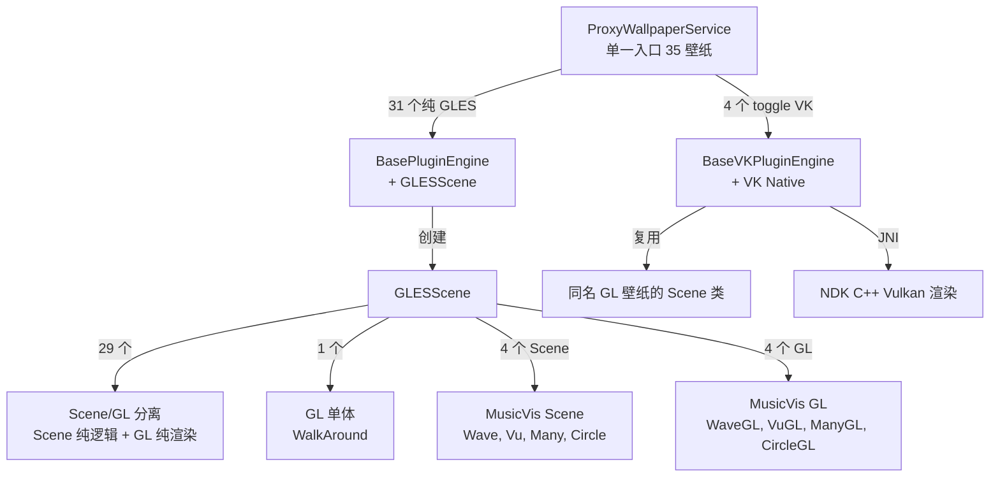
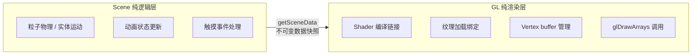
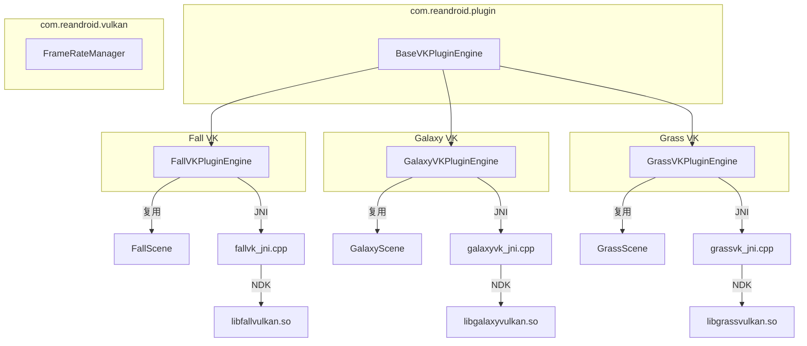

# 架构文档

>  **语言**：[English](ARCHITECTURE-en.md)

> 本文是 [README](README.md) 开发文档的展开。用户向的安装、配置与常见问题见 README；
> 贡献代码要遵守的约定见 [CONTRIBUTING.md](CONTRIBUTING.md)。

## 核心架构

### 插件三层接口

每个壁纸实现三个接口，由 ProxyWallpaperService 驱动生命周期：

```
WallpaperPlugin          → 插件工厂：getId() / createEngine() / release()
WallpaperEngine          → 渲染引擎：onCreate() / drawFrame() / onSurfaceChanged() / onTouchEvent() ...
WallpaperPluginHost      → 宿主机服务：getSharedPreferences() / getContext() / requestRender()
```

- **WallpaperPlugin** — 无参构造函数，由 ProxyWallpaperService 通过 `Class.forName()` 反射实例化
- **WallpaperEngine** — 管理自己的 EGL/Vulkan 上下文，接收所有 Surface 生命周期回调
- **WallpaperPluginHost** — 提供 `plugin_{id}` 隔离 SharedPreferences 和 ApplicationContext

### ProxyWallpaperService 调度逻辑

```
用户选择壁纸 → setActivePlugin(ctx, pluginId) → 写入 proxy_wallpaper prefs
系统创建壁纸 → ProxyWallpaperService.onCreateEngine()
  → 读取 pluginId
  → 打开 assets/{pluginId}/info.json → 读取 plugin 类名
  → 检查 plugin_{pluginId} prefs 中 use_vulkan 开关
  → 如果 VK=true 且 info.json 有 pluginVk 字段 → 使用 VK 类名
  → Class.forName() 实例化 WallpaperPlugin
  → plugin.createEngine(context, host) 创建 WallpaperEngine
  → ProxyEngine 转发所有 Surface 回调到 WallpaperEngine
```

### 语言资源解析链

设置页面的控件标签翻译来源是 `assets/{pluginId}/language/{locale}.json`，解析优先级：

1. 全 locale tag（如 `zh-rCN`）→ `PluginResources.loadLanguage(ctx, pluginId, "zh-rCN")`
2. 仅语言代码（如 `zh`）→ `loadLanguage(ctx, pluginId, "zh")`
3. 默认英文 → `loadLanguage(ctx, pluginId, "default")`

`layout.json` 中的 `title` / `summary` 字段存储的是 **language JSON 的 lookup key**（如 `"pref_grass_enabled"`），不是显示文本，也不是 `@string/` 引用。`DynamicPreferenceFactory` 先调 `resolveLang()` 查 language JSON，再调 `resolveStringRef()` 兜底处理残留的 `@string/` 引用。

### info.json Schema

每个 `assets/{pluginId}/info.json`：

```json
{
  "label": "@string/wallpaper_xxx",
  "plugin": "com.reandroid.wallpaper.xxx.XxxPlugin",
  "pluginVk": "com.reandroid.wallpaper.xxx.XxxVKPlugin",
  "previewClass": "com.reandroid.wallpaper.xxx.XxxGL",
  "permissions": ["ACCESS_FINE_LOCATION", "CAMERA"],
  "useLegacySettings": false
}
```

| 字段 | 必需 | 说明 |
| --- | --- | --- |
| `label` | ✔ | 壁纸显示名称（可 `@string/` 引用） |
| `plugin` | ✔ | GLES 插件类全限定名 |
| `pluginVk` | | Vulkan 插件类全限定名（有此字段时设置页显示 VK 开关） |
| `previewClass` | | 设置页实时预览的 GL 类，也可以是 Scene 类（vis2/vis3 就是直接指向 Scene） |
| `permissions` | | 运行时权限列表，API 常量名 |
| `hidden` | | `true` 时不在设置列表显示，且 `assembleRelease` 不把该资产编入 APK |
| `fragment` | | 旧版设置页的 Fragment 类（不配 `plugin` 时使用） |
| `useLegacySettings` | | `true` 时不走插件设置路径，改用 `fragment`。**当前没有壁纸使用**（PolarClock 早年用过，已迁到插件路径） |

### layout.json Schema

每个 `assets/{pluginId}/layout.json`：

```json
{
  "prefs": [
    {
      "type": "switch",
      "key": "pref_xxx_enabled",
      "title": "pref_xxx_enabled",
      "summary": "pref_xxx_desc",
      "default": true,
      "min": 0, "max": 100,
      "values": ["a", "b"],
      "labels": ["A", "B"],
      "dependency": "parent_key",
      "disableOn": "parent_key",
      "action": "pickBackground"
    }
  ]
}
```

| 字段 | 适用类型 | 说明 |
| --- | --- | --- |
| `type` | 全部 | `switch` / `seekbar` / `list` / `color` / `button` |
| `key` | 全部 | SharedPreferences 键名 |
| `title` | 全部 | language JSON lookup key |
| `summary` | 全部 | language JSON lookup key（可选） |
| `default` | 全部 | 默认值（switch: bool, seekbar/list: 数字或字符串） |
| `min`, `max` | seekbar | 取值范围 |
| `values` | list | 存储值数组 |
| `labels` | list | 显示标签数组（可 `@string/` 引用，也支持 `{key}_label_{value}` 模式） |
| `dependency` | 全部 | 父开关为 true 时才可用 |
| `disableOn` | 全部 | 父开关为 true 时禁用（与 dependency 相反） |
| `action` | button | `pickBackground`（图片选择）或 `resetBackground`（恢复默认） |

### 包结构

```
com.reandroid
├── gles/           GLESWallpaper / GLESScene / GLESPreviewView
├── plugin/         ProxyWallpaperService / BasePluginEngine / BaseVKPluginEngine
│                   WallpaperPlugin / WallpaperEngine / WallpaperPluginHost
│                   PluginSettingsFragment / PluginResources / DynamicPreferenceFactory
├── vulkan/         VKWallpaperEngine / VKSurfaceView / FrameRateManager
├── utils/          AssetLoader / GLTextureUtils / MathUtils / RawResourceLoader
├── settings/       SettingsActivity / SettingsMainFragment / PluginSettingsActivity
│                   PreviewPreference / WallpaperSettings / MiuiPermissionHelper
├── weather/        WeatherManager / WeatherCondition / WeatherState
├── update/         UpdateHelper / UpdateChecker / UpdateDownloader / VersionInfo
└── wallpaper/      35 Plugin + 35 Engine + 27 Scene + 30 GL（按子包划分）
    ├── weatherwallpapers/  Ocean / Windmill
    ├── musicvis/           5 个音乐可视化插件，共享 Scene/GL/资产
    └── ......
```

### 渲染路径



### Scene/GL 分离模式

绝大多数壁纸采用 Scene（纯逻辑）+ GL（纯渲染）分离，现有 33 个 Scene 类（唯一没有独立 Scene 的是 `walkaround`，它的逻辑本身就是 Camera API 管道，拆出去也跑不了 JVM 测试）：

- **Scene 类**：`package-private final class`，负责物理模拟、动画状态、实体管理，零 Android/GL 导入
- **GL 类**：`public class extends GLESScene`，负责 shader 编译、纹理加载、绘制调用，不包含业务逻辑
- **Mat4**：纯 Java 矩阵运算（`orthoM`、`frustumM`、`translateM`、`rotateM`、`multiplyMM`），作用与 `android.opengl.Matrix` 相同但**不是 Android 类** —— 用它的 Scene 可以在 JVM 上直接编译运行、写单元测试。目前 5 个文件用 Mat4，**另有 10 个 Scene 仍在用 `android.opengl.Matrix`**（它们因此无法在 JVM 上跑）。新写的 Scene 建议用 Mat4



29 个 Scene/GL 分离壁纸：Aurora1、Aurora2、BlueSea、CosmicFlow、Cube、DeepSea、Droid、Earth、Fall、Fireworks、Forest、Galaxy、Galaxy4、GeekLog、Grass、HoloSpiral、LuminousDots、MagicSmoke、Microbes、Nexus、NightSky、NixieTube、NoiseField、Ocean、PhaseBeam、PolarClock、Silk、WildWorld、Windmill

4 个 MusicVis Scene 类供 5 个插件共享：WaveScene（vis2 FFT + vis3 PCM）、VuScene（vis4）、ManyScene（vis5 → WaveScene + VuScene 组合）、CircleScene（vis6）

1 个 GL 单体壁纸：WalkAround（相机直通 — 无可提取逻辑）

### 预置注入

插件引擎通过反射将 `plugin_{id}` 隔离 SharedPreferences 注入 Scene 对象：

1. `BasePluginEngine.tryInjectPrefs()` / `BaseVKPluginEngine` 构造函数调用
2. 通过反射调用 `scene.setPluginPrefs(SharedPreferences)`
3. Scene 内的 `WallpaperSettings.getXxx()` 优先读取注入的 prefs
4. ProGuard 规则保留 `setPluginPrefs` 方法不被混淆

### GLES 渲染引擎

BasePluginEngine 封装 EGL 上下文管理和**延迟初始化**：

```
onSurfaceChanged (main thread)
  → 仅存储 surface / resources / preview 到待处理字段
  → mSceneInitPending = true

首次 drawFrame (render thread, EGL 已 current)
  → if mSceneInitPending:
      → mScene.init(surface, resources, preview)  // GL 命令可安全执行
      → mScene.resize(width, height)
      → mScene.start()
      → mSceneInitPending = false
```

这解决了 `onSurfaceChanged` 在主线程调用但 GL 操作必须在 render thread 执行的问题。

### Vulkan 路径

4 个壁纸（Fall、Galaxy、Galaxy4、Grass）提供 Vulkan 后端，通过 `BaseVKPluginEngine` 实现 `WallpaperEngine` + `Runnable`，自管渲染线程。复用同名 GL 壁纸的 Scene 纯逻辑类。



- `BaseVKPluginEngine`（`com.reandroid.plugin`）封装线程管理、Surface 生命周期、帧率诊断
- 子类实现模板方法：`createRenderer()`、`destroyRenderer()`、`onSurfaceCreatedNative()`、`renderFrame()`、`uploadTextures()`
- Native 代码通过 [vk_common.h](app/src/main/jni/vk_common.h) CRTP 模板共享基础设施：679 + 1176 + 1321 + 1540 = **4716** 行
- `FrameRateManager` 提供共享 FPS 控制与 ANR 诊断（阈值 200ms，每 120 帧统计一次）
- `vkArgbToRgba()` 转换 Android ARGB → Vulkan RGBA 字节序
- Swapchain 格式使用 UNORM（非 SRGB）避免双重伽马校正

### MusicVis 架构

5 个音乐可视化插件共享 4 个 Scene 类和 4 个 GL 类：

| 插件 | Scene | GL | 音频模式 |
| --- | --- | --- | --- |
| vis2 | WaveScene | MusicVisWaveGL | FFT |
| vis3 | WaveScene | MusicVisWaveGL | PCM |
| vis4 | VuScene | MusicVisVuGL | PCM |
| vis5 | ManyScene（WaveScene + VuScene 组合） | MusicVisManyGL | FFT |
| vis6 | CircleScene | MusicVisCircleGL | FFT |

- **AudioVisBase** — 抽象基类，管理 AudioCapture 生命周期、HSL 重着色、预置
- **AudioCapture** — 双缓冲 Visualizer 捕获：`mRawBufferA/B` + `mReadyRawBuffer`，捕获线程写、渲染线程读，无锁交换；3 秒空闲超时自动停止
- **ManyScene** — WaveScene + VuScene 实例组合，非继承

### 共享资产

两个跨壁纸的共享资产目录（不归单个壁纸所有）：

- [assets/musicvis/](app/src/main/assets/musicvis/) — 10 个 GLSL shader、10 张纹理（VU 表头/帧/指针/峰值）、1 个 quad UV CSV，供 5 个 MusicVis 插件共享
- [assets/weatherwallpapers/common/drawable/](app/src/main/assets/weatherwallpapers/common/drawable/) — 85 张天气纹理（云/雨/雪/闪电/雾/太阳/水滴动画帧序列），供 Ocean + Windmill 共享

### 设置系统

`SettingsActivity` 统一入口 → 2 列网格壁纸列表（自动从 `assets/*/info.json` 发现）→ 通用 `PluginSettingsFragment`（`layout.json` 驱动）。

- 实时预览 / Vulkan 开关 / 自定义背景 / 依赖互斥 / 恢复默认
- 全局帧率（overflow menu → 8 档可选）/ 预览比例 / Reset All
- 天气按钮（单击 PopupMenu / 长按调试弹窗）
- 自动权限请求 / MIUI 适配 / ThemeOverlay 主题弹窗
- 24h 缓存更新检查（中英文 changelog）

### 测试活动

Manifest 声明 8 个 `CATEGORY_TEST` 活动，可用于 adb 单独启动壁纸调试：

```
Grass / GrassVK / Aurora1 / Aurora2 / Galaxy / GalaxyVK / Fall / FallVK
```

每个通过 `res/values/config.xml` 中的 `config_enable_*_wallpaper` bool 控制启用。

### ProGuard 反射规则

```proguard
-keepclasseswithmembernames class * { native <methods>; }
-keep public class * extends android.service.wallpaper.WallpaperService
-keep public class * extends android.app.Activity
-keep public class * extends androidx.preference.PreferenceFragmentCompat
-keepclassmembers class * extends com.reandroid.gles.GLESScene {
    public void setPluginPrefs(android.content.SharedPreferences);
}
```

## 项目结构

```
app/src/main/
├── java/com/reandroid/
│   ├── gles/              GLES 框架基类
│   ├── plugin/            插件架构核心
│   ├── vulkan/            Vulkan 工具类
│   ├── utils/             工具类
│   ├── settings/          设置 UI
│   ├── weather/           天气数据层
│   ├── update/            更新系统
│   └── wallpaper/         所有壁纸（每壁纸 Plugin + Engine + GL，多数另有 Scene）
├── assets/
│   ├── {wallpaper}/        每个壁纸独立资产（35 个）
│   │   ├── drawable/        纹理图片
│   │   ├── shaders/GLES/    GLSL 着色器
│   │   ├── data/            CSV 网格/顶点数据
│   │   ├── language/        每壁纸多语言 JSON（13 种语言）
│   │   ├── info.json        插件元数据
│   │   └── layout.json      动态偏好界面定义
│   ├── musicvis/            MusicVis 5 插件共享资产
│   └── weatherwallpapers/   Ocean + Windmill 共享天气纹理（85 张）
├── res/
│   ├── xml/               5 个 XML 配置
│   ├── values/            字符串（13 种语言）/ 主题 / config.xml
│   ├── values-night/      暗色主题
│   ├── layout/            设置页布局
│   ├── drawable/          天气图标 / 启动图标
│   └── menu/              菜单
├── jni/                   Vulkan NDK C++ 源码 + Android.mk
├── jniLibs/               Vulkan 预编译 .so（4 壁纸 × 4 架构 = 16 个）
└── shaders/               Vulkan GLSL 着色器源码（构建时编译为 SPIR-V）
```

## 构建配置

### 环境要求

- Android Studio（最新稳定版）
- JDK 21
- Android Gradle Plugin 8.7.3 / Gradle 8.10
- Android SDK Platform 35
- Android NDK 25.2.9519653（项目固定版本）
- compileSdk 35 / minSdk 24 / targetSdk 35

### 构建

```bash
# Debug
./gradlew assembleDebug

# Release（自动递增版本号）
./gradlew assembleRelease
```

Vulkan 壁纸需要 `arm64-v8a`、`armeabi-v7a`、`x86_64`、`x86`。Native 编译使用 [Android.mk](app/src/main/jni/Android.mk)（ndk-build），在 `preBuild` 阶段自动触发。预编译 `.so` 输出到 [app/src/main/jniLibs/](app/src/main/jniLibs/)。

