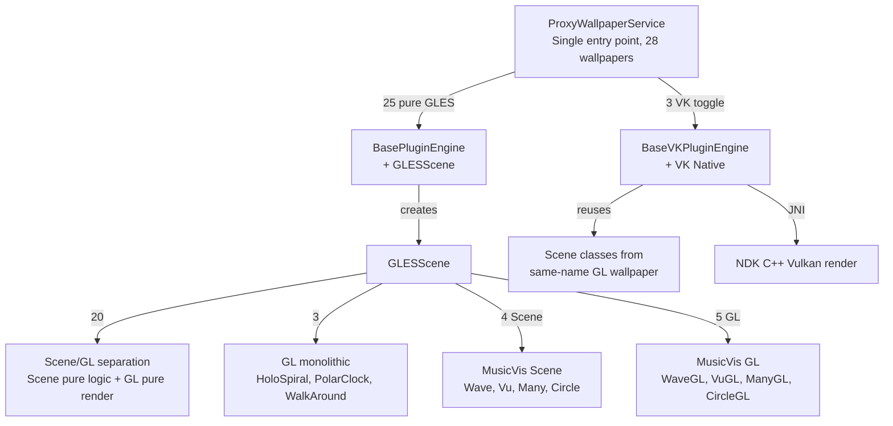
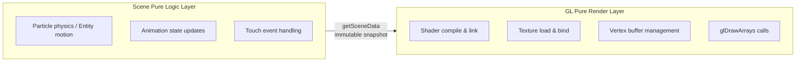
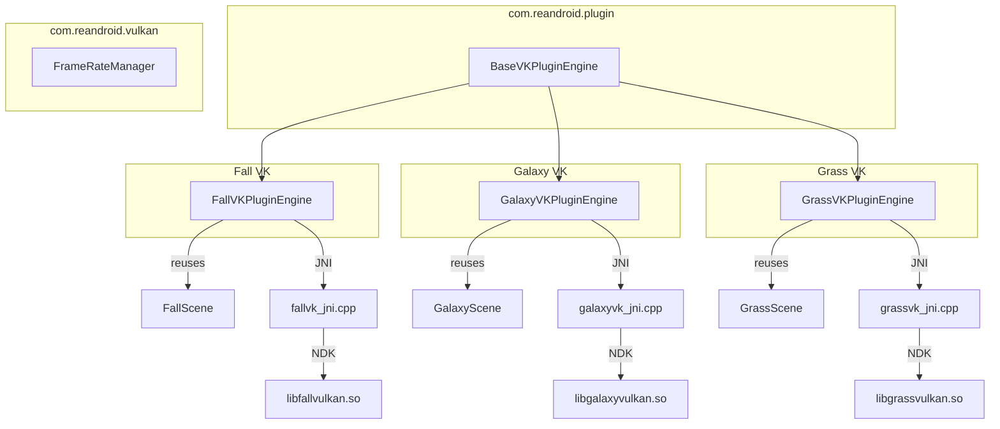

# Reborn Android Live Wallpapers

[简体中文](README.md)

An Android live wallpaper collection that ports classic AOSP / MediaTek wallpapers from RenderScript to OpenGL ES 2.0 and Vulkan, allowing them to run on modern Android versions.

> **Quick Navigation**: [User Guide](#user-guide) · [Installation](#installation) · [Weather Setup](#weather-setup) · [Music Visualization](#music-visualization) · [Permissions](#permissions) · [Performance Reference](#performance-reference) · [FAQ](#faq) 　|　 [Developer Docs](#developer-docs)

---

<a id="user-guide"></a>
# User Guide

## Installation

**Download & Install**
1. Download the APK from [GitHub Releases](../../releases) or [ApkPure](https://apkpure.com/p/com.reandroid.wallpaper)
2. Allow "Install unknown apps" permission for your browser/file manager, then install
3. Supports Android 4.4 (API 19) and above; AndroidX+ devices recommended

**Setting as Wallpaper**

Method 1 (recommended): Open the app → select a wallpaper → enter its settings page → tap "Open System Preview"

Method 2: Open the app → open wallpaper picker → find "REAndroid Live Wallpapers" (may not work on heavily customized Chinese ROMs)

Method 3: Long-press home screen → Wallpapers → find "REAndroid Live Wallpapers" (may not work on heavily customized Chinese ROMs)

> Method 1 skips the system wallpaper picker and goes directly to preview. MIUI users will see a permission guide popup on first setup.

**Each wallpaper has its own settings** — particle count, color, animation speed, etc. can all be adjusted. A real-time preview appears at the top of each settings page.

## Wallpaper List

**28** wallpapers total, with **3** (Galaxy, Grass, Fall) offering an additional Vulkan backend

| Wallpaper | Type | VK | Description |
| --- | --- | --- | --- |
| Galaxy | Starfield | ✓ | Rotating star field, color gradients |
| Galaxy4 | Starfield | | Rotating star field, color gradients |
| NightSky | Starfield | | 9,000 real stars from the Hipparcos catalog, gyroscope tracking, long-press to accelerate star trails |
| Microbes | Particles | | Microbial swarm AI, touch to feed, reproduction/death cycle |
| Grass | Nature | ✓ | Wind-blown grass, solar/lunar eclipses, weather integration |
| WildWorld | Nature | | Prehistoric world with volcanoes, dinosaurs, pterosaurs, fireballs |
| WalkAround | Nature | | Camera perspective — what you see is what you get |
| Cube | 3D | | 8 wireframe shapes, 3D rotation, touch drag |
| Forest | Nature | | Forest with parallax scrolling |
| DeepSea | Nature | | Deep-sea jellyfish swarm, gyroscope tracking |
| BlueSea | Nature | | Floating jellyfish, rising particles, tap to light up |
| Fall | Nature | ✓ | Falling autumn leaves, water ripples |
| Ocean | Weather | | Ocean weather wallpaper — waves/clouds/precipitation linked to real weather |
| Windmill | Weather | | Windmill weather wallpaper — wind speed and sky change with weather |
| Nexus | Effects | | Pulsed halo |
| PhaseBeam | Effects | | Phase beam, HSL color tuning |
| NoiseField | Effects | | Perlin noise particles, touch perturbation |
| HoloSpiral | Effects | | Holographic spiral, 3D perspective rotation |
| MagicSmoke | Effects | | Multi-layer smoke blending, psychedelic effect |
| Aurora1 | Aurora | | Northern lights, 99-frame glow animation |
| Aurora2 | Aurora | | Northern lights v2, more brilliant colors |
| Fireworks | Effects | | Firework particles, tap to launch |
| PolarClock | Clock | | Polar clock, three palette styles |
| vis2 | Music | | Audio spectrum visualization — FFT waveform |
| vis3 | Music | | Audio spectrum visualization — PCM waveform |
| vis4 | Music | | Audio visualization — VU meter style |
| vis5 | Music | | Audio visualization — Waveform + VU combo |
| vis6 | Music | | Audio visualization — Circular spectrum |

## Feature Highlights

Compared to the original AOSP/MediaTek wallpapers:
- **Modern OS Compatibility**: Originals relied on RenderScript (deprecated in Android 12+). Everything is rewritten in GLES/Vulkan.
- **Independent Settings**: Each wallpaper has its own settings page — adjust particle count, color, animation speed, etc.
- **Weather Integration**: Grass, Ocean, and Windmill change visuals based on real weather (requires API key).
- **Music Visualization**: 5 audio spectrum styles — wallpapers react to music in real time.
- **Vulkan Backend**: Galaxy, Grass, and Fall support optional Vulkan rendering.

<a id="weather-setup"></a>
## Weather Setup

Three wallpapers — Grass (dynamic meadow), Ocean (ocean weather), Windmill — can change their visuals based on real weather: sunny skies, thicker clouds on overcast days, rain/snow particle effects.

**Setup Steps:**

1. Open the [OpenWeatherMap sign-up page](https://home.openweathermap.org/users/sign_up) and register a free account
2. After login, go to [API Keys](https://home.openweathermap.org/api_keys) and copy the default key
3. Open the app → tap the weather icon in the toolbar → "OpenWeather API Key" → paste your key → confirm
4. Return to the main screen — the weather icon should display current weather conditions

> Free tier: 1,000 calls/day. Default update interval is 30 minutes (can be changed to 15/30/60/180 min in "Update Interval"). If you don't register, weather wallpapers still function normally, but won't reflect real weather.

**Debugging**: Long-press the weather icon to manually override weather conditions (clear/cloudy/rain/snow etc. — 10 presets), useful for testing how wallpapers look under different weather.

<a id="music-visualization"></a>
## Music Visualization

vis2–vis6 are 5 audio spectrum visualization wallpapers. When music plays, the wallpaper reacts to the audio rhythm.

**How to Use:**
1. Set any of vis2–vis6 as your wallpaper
2. Grant the "Record Audio" permission (only used to read audio spectrum; no audio data is saved)
3. Play music or video on your phone
4. The wallpaper will automatically respond to the audio

| Plugin | Style | Mode | Characteristics |
| --- | --- | --- | --- |
| vis2 | Color Waveform | FFT Spectrum | Multi-band spectrum bars, HSL gradient |
| vis3 | Color Waveform | PCM Waveform | Continuous waveform curve, smoother |
| vis4 | VU Meter | PCM | Classic audio level meter, swinging needle |
| vis5 | Combo View | FFT | 3D rotation |
| vis6 | Circular Spectrum | FFT | 360° surrounding spectrum |

> Android system limits audio capture sample rate. AndroidX+ requires additional authorization to capture system audio.

<a id="permissions"></a>
## Permissions

Permissions requested by the app and their reasons:

| Permission | Used By | Reason | Optional |
| --- | --- | --- | --- |
| Storage Read | Fireworks (custom background) | Select a local image as fireworks background | ✓ |
| Location (fine/coarse) | Grass, NightSky | Calculate precise sunrise/sunset times based on location, etc. | ✓ |
| Camera | WalkAround | Use camera feed as wallpaper background (perspective effect) | ✓ |
| Record Audio | vis2–vis6 | Capture system audio output for spectrum visualization | ✓ |
| Internet | Weather, Update Check | Fetch weather data, check for updates | ✓ |
| Live Wallpaper Service | System | Required Android permission for live wallpapers | ✕ |

> ✓ = optional, denying won't break basic wallpaper functionality　✕ = required on some systems

<a id="performance-reference"></a>
## Performance Reference

Hardware consumption varies significantly across wallpapers:

| Level | Wallpapers | Notes |
| --- | --- | --- |
| Low Power | PolarClock, HoloSpiral, Forest | Mostly static, minimal animation updates |
| Medium | Ocean, Windmill, Aurora1/2, Cube, DeepSea, BlueSea, Nexus, PhaseBeam, NoiseField, MagicSmoke, WalkAround, WildWorld | Continuous animation or particles, but manageable load |
| High Power | Galaxy, Galaxy4, NightSky, Microbes, Grass, Fall, Fireworks, vis2–6 | Large particle count / entity AI / real-time audio processing |

**Power-saving Tips:**
- Lower particle count or grass blade count via wallpaper settings
- Set global framerate to 30 FPS (Settings page overflow menu → Global Framerate)
- For Galaxy/Grass/Fall, try enabling Vulkan rendering
- Weather integration can be turned off (Grass settings → disable "Enable Weather Effects")

<a id="faq"></a>
## FAQ

**Q: Can't open wallpaper preview**
MIUI/HyperOS users need to grant "Live Wallpaper Service" permission in system settings. The app automatically detects MIUI on first launch and shows a guide.

**Q: Weather not showing / showing incorrectly?**
Check: ① Is the OpenWeather API Key filled in correctly? ② Is location permission granted? ③ Is the network working? (Some regions/ISPs may not reach OpenWeather) ④ Has the free quota run out? (1,000 calls/day) Long-press the weather icon to see the last refresh time.

**Q: Why can't I see the Vulkan toggle?**
Only Galaxy, Grass, and Fall have Vulkan backends. If your device doesn't support Vulkan, the toggle will be visible but switching may have no effect or cause crashes.

**Q: Music visualization isn't responding?**
Confirm: ① Record Audio permission is granted ② Audio is currently playing (media volume is not zero)

**Q: What's the ideal global framerate setting?**
Default 60 FPS suits most devices. Low-end devices: 24 FPS recommended. High-refresh-rate screens: 90/120 FPS. Note: higher framerate = more battery consumption.

---

<a id="developer-docs"></a>
# Developer Docs

## Core Architecture

### Three-Layer Plugin Interface

Each wallpaper implements three interfaces, with lifecycle driven by ProxyWallpaperService:

```
WallpaperPlugin          → Plugin factory: getId() / createEngine() / release()
WallpaperEngine          → Render engine: onCreate() / drawFrame() / onSurfaceChanged() / onTouchEvent() ...
WallpaperPluginHost      → Host service: getSharedPreferences() / getContext() / requestRender()
```

- **WallpaperPlugin** — No-arg constructor, instantiated by ProxyWallpaperService via `Class.forName()` reflection
- **WallpaperEngine** — Manages its own EGL/Vulkan context, receives all Surface lifecycle callbacks
- **WallpaperPluginHost** — Provides `plugin_{id}` isolated SharedPreferences and ApplicationContext

### ProxyWallpaperService Dispatch Logic

```
User selects wallpaper → setActivePlugin(ctx, pluginId) → writes to proxy_wallpaper prefs
System creates wallpaper → ProxyWallpaperService.onCreateEngine()
  → reads pluginId
  → opens assets/{pluginId}/info.json → reads plugin class name
  → checks plugin_{pluginId} prefs for use_vulkan toggle
  → if VK=true and info.json has pluginVk field → uses VK class name
  → Class.forName() instantiates WallpaperPlugin
  → plugin.createEngine(context, host) creates WallpaperEngine
  → ProxyEngine forwards all Surface callbacks to WallpaperEngine
```

### Language Resource Resolution Chain

Control label translations in settings pages come from `assets/{pluginId}/language/{locale}.json`, with resolution priority:

1. Full locale tag (e.g., `zh-rCN`) → `PluginResources.loadLanguage(ctx, pluginId, "zh-rCN")`
2. Language code only (e.g., `zh`) → `loadLanguage(ctx, pluginId, "zh")`
3. Default English → `loadLanguage(ctx, pluginId, "default")`

The `title`/`summary` fields in `layout.json` store **language JSON lookup keys** (e.g., `"pref_grass_enabled"`), not display text, and not `@string/` references. `DynamicPreferenceFactory` calls `resolveLang()` to check the language JSON first, then `resolveStringRef()` as a fallback for any remaining `@string/` references.

### info.json Schema

Located at `assets/{pluginId}/info.json`:

```json
{
  "label": "@string/wallpaper_xxx",
  "plugin": "com.reandroid.wallpaper.xxx.XxxPlugin",
  "pluginVk": "com.reandroid.wallpaper.xxx.XxxVKPlugin",
  "previewClass": "com.reandroid.wallpaper.xxx.XxxGL",
  "permissions": ["ACCESS_FINE_LOCATION", "CAMERA"],
  "useLegacySettings": false
}
```

| Field | Required | Description |
| --- | --- | --- |
| `label` | ✓ | Wallpaper display name (can reference `@string/`) |
| `plugin` | ✓ | GLES plugin fully-qualified class name |
| `pluginVk` | | Vulkan plugin fully-qualified class name (when present, VK toggle appears in settings) |
| `previewClass` | | GL class for real-time preview in settings (recommended for better UX) |
| `permissions` | | Runtime permission list, API constant names |
| `useLegacySettings` | | `true` to use a standalone settings Activity (PolarClock only) |

### layout.json Schema

Located at `assets/{pluginId}/layout.json`:

```json
{
  "prefs": [
    {
      "type": "switch",
      "key": "pref_xxx_enabled",
      "title": "pref_xxx_enabled",
      "summary": "pref_xxx_desc",
      "default": true,
      "min": 0, "max": 100,
      "values": ["a", "b"],
      "labels": ["A", "B"],
      "dependency": "parent_key",
      "disableOn": "parent_key",
      "action": "pickBackground"
    }
  ]
}
```

| Field | Applies To | Description |
| --- | --- | --- |
| `type` | All | `switch` / `seekbar` / `list` / `button` |
| `key` | All | SharedPreferences key name |
| `title` | All | Language JSON lookup key |
| `summary` | All | Language JSON lookup key (optional) |
| `default` | All | Default value (switch: bool, seekbar/list: number or string) |
| `min`, `max` | seekbar | Value range |
| `values` | list | Stored value array |
| `labels` | list | Display label array (can use `@string/` references; also supports `{key}_label_{value}` pattern) |
| `dependency` | All | Only enabled when parent switch is true |
| `disableOn` | All | Disabled when parent switch is true (opposite of dependency) |
| `action` | button | `pickBackground` (image picker) or `resetBackground` (restore default) |

### Package Structure

```
com.reandroid
├── gles/           GLESWallpaper / GLESScene / GLESPreviewView
├── plugin/         ProxyWallpaperService / BasePluginEngine / BaseVKPluginEngine
│                   WallpaperPlugin / WallpaperEngine / WallpaperPluginHost
│                   PluginSettingsFragment / PluginResources / DynamicPreferenceFactory
├── vulkan/         VKWallpaperEngine / VKSurfaceView / FrameRateManager
├── utils/          AssetLoader / GLTextureUtils / MathUtils / RawResourceLoader
├── settings/       SettingsActivity / SettingsMainFragment / PluginSettingsActivity
│                   PreviewPreference / WallpaperSettings / MiuiPermissionHelper
├── weather/        WeatherManager / WeatherCondition / WeatherState
├── update/         UpdateHelper / UpdateChecker / UpdateDownloader / VersionInfo
└── wallpaper/      31 Plugin + 31 Engine + 24 Scene + 27 GL (grouped by subpackage)
    ├── weatherwallpapers/  Ocean / Windmill
    ├── musicvis/           5 music visualization plugins, shared Scene/GL/assets
    └── ......
```

### Render Paths



### Scene/GL Separation Pattern

20 wallpapers adopt Scene (pure logic) + GL (pure rendering) separation:

- **Scene class**: `package-private final class`, handles physics, animation state, entity management — zero Android/GL imports
- **GL class**: `public class extends GLESScene`, handles shader compilation, texture loading, draw calls — no business logic
- **Mat4**: Pure Java matrix math (`orthoM`, `frustumM`, `translateM`, `rotateM`, `multiplyMM`), replaces `android.opengl.Matrix` — this is the key that allows Scene classes to maintain zero Android dependencies



20 Scene/GL separated wallpapers: Aurora1, Aurora2, BlueSea, Cube, DeepSea, Fall, Fireworks, Forest, Galaxy, Galaxy4, Grass, MagicSmoke, Microbes, Nexus, NightSky, NoiseField, Ocean, PhaseBeam, WildWorld, Windmill

4 MusicVis Scene classes shared by 5 plugins: WaveScene (vis2 FFT + vis3 PCM), VuScene (vis4), ManyScene (vis5 → WaveScene + VuScene combo), CircleScene (vis6)

3 GL monolithic wallpapers: HoloSpiral (spiral math), PolarClock (palette system), WalkAround (camera passthrough — no extractable logic)

### Preference Injection

The plugin engine injects `plugin_{id}` isolated SharedPreferences into Scene objects via reflection:

1. `BasePluginEngine.tryInjectPrefs()` / `BaseVKPluginEngine` constructor
2. Calls `scene.setPluginPrefs(SharedPreferences)` via reflection
3. `WallpaperSettings.getXxx()` inside Scene prioritizes the injected prefs
4. ProGuard rules keep the `setPluginPrefs` method from being obfuscated

### GLES Render Engine

BasePluginEngine encapsulates EGL context management and **deferred initialization**:

```
onSurfaceChanged (main thread)
  → only stores surface / resources / preview to pending fields
  → mSceneInitPending = true

first drawFrame (render thread, EGL already current)
  → if mSceneInitPending:
      → mScene.init(surface, resources, preview)  // GL commands safe to execute
      → mScene.resize(width, height)
      → mScene.start()
      → mSceneInitPending = false
```

This solves the problem where `onSurfaceChanged` is called on the main thread but GL operations must execute on the render thread.

### Vulkan Path

3 wallpapers (Fall, Galaxy, Grass) provide Vulkan backends, implementing `WallpaperEngine` + `Runnable` via `BaseVKPluginEngine`, with self-managed render threads. They reuse the Scene pure logic classes from their GL counterparts.



- `BaseVKPluginEngine` (`com.reandroid.plugin`) encapsulates thread management, Surface lifecycle, frame rate diagnostics
- Subclasses implement template methods: `createRenderer()`, `destroyRenderer()`, `onSurfaceCreatedNative()`, `renderFrame()`, `uploadTextures()`
- Native code shares infrastructure via [vk_common.h](app/src/main/jni/vk_common.h) CRTP template: 679 + 1176 + 1321 + 1540 = **4,716** lines
- `FrameRateManager` provides shared FPS control and ANR diagnostics (threshold 200ms, stats every 120 frames)
- `vkArgbToRgba()` converts Android ARGB → Vulkan RGBA byte order
- Swapchain format uses UNORM (not SRGB) to avoid double gamma correction

### MusicVis Architecture

5 music visualization plugins share 4 Scene classes and 4 GL classes:

| Plugin | Scene | GL | Audio Mode |
| --- | --- | --- | --- |
| vis2 | WaveScene | MusicVisWaveGL | FFT |
| vis3 | WaveScene | MusicVisWaveGL | PCM |
| vis4 | VuScene | MusicVisVuGL | PCM |
| vis5 | ManyScene (WaveScene + VuScene combo) | MusicVisManyGL | FFT |
| vis6 | CircleScene | MusicVisCircleGL | FFT |

- **AudioVisBase** — Abstract base class managing AudioCapture lifecycle, HSL re-coloring, presets
- **AudioCapture** — Double-buffered Visualizer capture: `mRawBufferA/B` + `mReadyRawBuffer`, capture thread writes, render thread reads, lock-free swap; 3-second idle timeout auto-stop
- **ManyScene** — WaveScene + VuScene instance composition, not inheritance

### Shared Assets

Two cross-wallpaper shared asset directories (not owned by any single wallpaper):

- [assets/musicvis/](app/src/main/assets/musicvis/) — 10 GLSL shaders, 10 textures (VU meter face/frame/needle/peak), 1 quad UV CSV, shared by 5 MusicVis plugins
- [assets/weatherwallpapers/common/drawable/](app/src/main/assets/weatherwallpapers/common/drawable/) — 85 weather textures (cloud/rain/snow/lightning/fog/sun/water droplet animation frame sequences), shared by Ocean + Windmill

### Settings System

`SettingsActivity` unified entry → 2-column grid wallpaper list (auto-discovered from `assets/*/info.json`) → generic `PluginSettingsFragment` (driven by `layout.json`).

- Real-time preview / Vulkan toggle / custom background / dependency & mutual exclusion / restore defaults
- Global framerate (overflow menu → 8 options) / preview aspect ratio / Reset All
- Weather button (tap for PopupMenu / long-press for debug dialog)
- Auto permission requests / MIUI adaptation / ThemeOverlay themed dialog
- 24h-cached update check (Chinese & English changelog)

### Test Activities

The manifest declares 8 `CATEGORY_TEST` activities for individual wallpaper debugging via adb:

```
Grass / GrassVK / Aurora1 / Aurora2 / Galaxy / GalaxyVK / Fall / FallVK
```

Each is controlled by a `config_enable_*_wallpaper` bool in `res/values/config.xml`.

### ProGuard Reflection Rules

```proguard
-keepclasseswithmembernames class * { native <methods>; }
-keep public class * extends android.service.wallpaper.WallpaperService
-keep public class * extends android.app.Activity
-keep public class * extends androidx.preference.PreferenceFragmentCompat
-keepclassmembers class * extends com.reandroid.gles.GLESScene {
    public void setPluginPrefs(android.content.SharedPreferences);
}
```

## Project Structure

```
app/src/main/
├── java/com/reandroid/
│   ├── gles/              GLES framework base classes
│   ├── plugin/            Plugin architecture core
│   ├── vulkan/            Vulkan utility classes
│   ├── utils/             Utilities
│   ├── settings/          Settings UI
│   ├── weather/           Weather data layer
│   ├── update/            Update system
│   └── wallpaper/         All wallpapers (31 Plugin + 31 Engine + 24 Scene + 27 GL)
├── assets/
│   ├── {wallpaper}/        Per-wallpaper asset directories (28 total)
│   │   ├── drawable/        Texture images
│   │   ├── shaders/GLES/    GLSL shaders
│   │   ├── data/            CSV mesh/vertex data
│   │   ├── language/        Per-wallpaper i18n JSON (13 languages)
│   │   ├── info.json        Plugin metadata
│   │   └── layout.json      Dynamic preference UI definition
│   ├── musicvis/            Shared assets for 5 MusicVis plugins
│   └── weatherwallpapers/   Shared weather textures (85 images) for Ocean + Windmill
├── res/
│   ├── xml/               5 XML config files
│   ├── values/            Strings (13 languages) / themes / config.xml
│   ├── values-night/      Dark theme
│   ├── layout/            Settings page layouts (8 files)
│   ├── drawable/          Weather icons / launcher icons
│   └── menu/              2 menu files
├── jni/                   Vulkan NDK C++ source (4 files + Android.mk)
├── jniLibs/               Vulkan prebuilt .so (4 architectures × 3 = 12 files)
└── shaders/               Vulkan GLSL shader sources (compiled to SPIR-V at build time)
```

## Build Configuration

### Requirements

- Android Studio (latest stable)
- JDK 17
- Android SDK Platform 33
- Android NDK 25.2.9519653 (project-fixed version)
- minSdk 19 / targetSdk 33

### Build

```bash
# Debug
./gradlew assembleDebug

# Release (auto-increment version code)
./gradlew assembleRelease
```

Vulkan wallpapers require `arm64-v8a`, `armeabi-v7a`, `x86_64`, `x86`. Native compilation uses [Android.mk](app/src/main/jni/Android.mk) (ndk-build), triggered automatically during the `preBuild` phase. Prebuilt `.so` files are output to [app/src/main/jniLibs/](app/src/main/jniLibs/).

## License

[LICENSE](LICENSE) · [NOTICE](NOTICE.md)