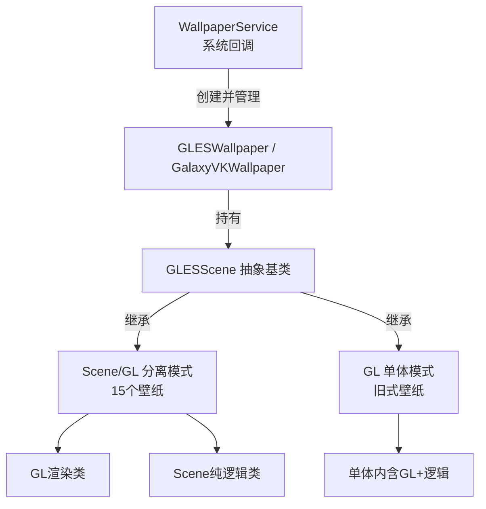
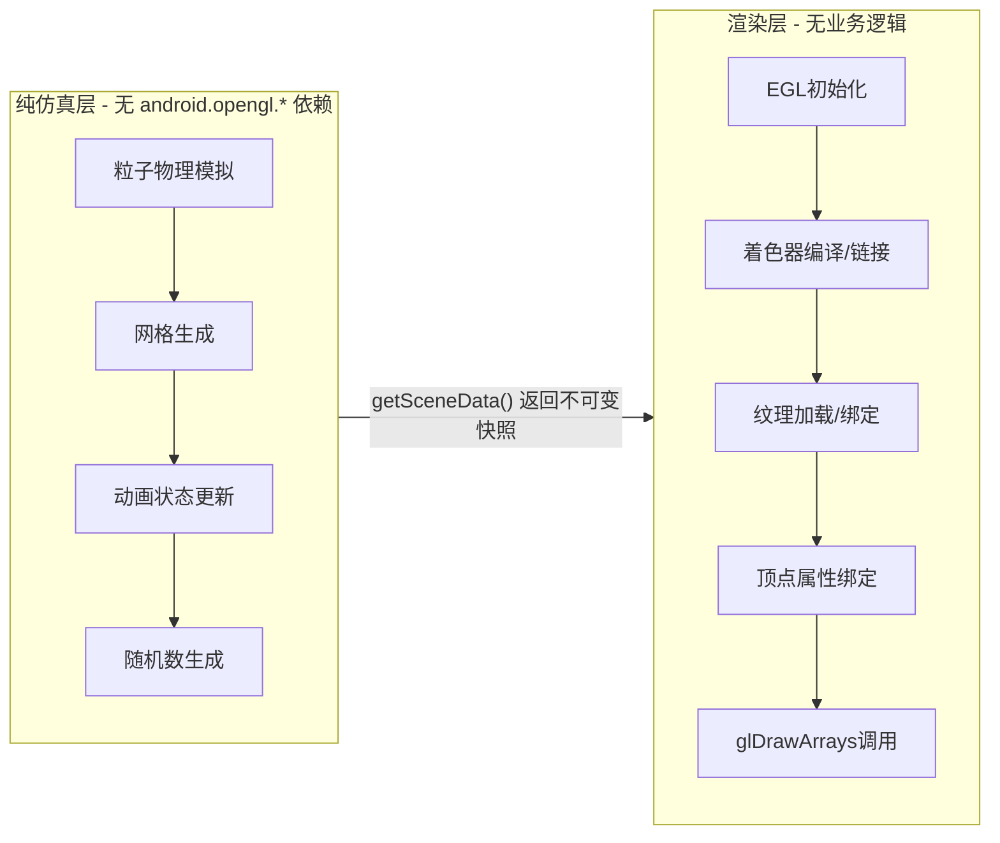
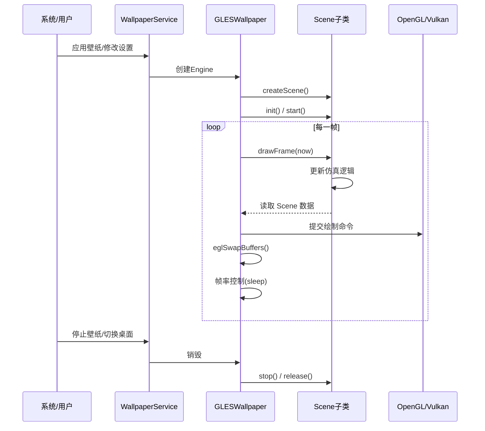

# Reborn Android Live Wallpapers

一个 Android 动态壁纸合集工程，聚焦高流畅度视觉效果与统一设置体验。

## 壁纸特点

1. 壁纸类型覆盖广：
	粒子与星空类（Galaxy、NightSky、Nebula、Microbes）、自然场景类（Grass、WildWorld、WalkAround、DeepSea、BlueSea）、特效类（MagicSmoke、HoloSpiral、Nexus、PhaseBeam、Noisefield）等。
2. 双渲染路径：
	以 OpenGL ES 为主，同时包含 Vulkan 版本实验实现（如 Fall/Galaxy/Grass 的 VK 变体），便于性能对比与效果迭代。
3. 每张壁纸独立可配：
	亮度、速度、粒子数量、触控反馈等参数可在设置页单独调整，适合按机型性能做取舍。
4. 统一设置入口：
	所有壁纸在同一套 Settings 界面中管理，切换、预览、恢复默认配置流程一致。
5. 面向移动端优化：
	最低支持 Android 4.4（API 19），保留对低端设备的兼容，同时支持高帧率设备上的增强效果。

## 壁纸清单速览

| 分类 | 代表壁纸 | 对应模块目录 |
| --- | --- | --- |
| 粒子/星空 | Galaxy、Galaxy4、NightSky、Nebula、Microbes | app/src/main/java/com/reandroid/wallpaper/galaxy 等 |
| 自然/环境 | Grass、WildWorld、WalkAround、DeepSea、BlueSea | app/src/main/java/com/reandroid/wallpaper/grass 等 |
| 程序化特效 | Nexus、PhaseBeam、Noisefield、HoloSpiral、MagicSmoke | app/src/main/java/com/reandroid/wallpaper/nexus 等 |
| 天气与可视化 | WeatherWallpapers、MusicVis、Fall | app/src/main/java/com/reandroid/wallpaper/weatherwallpapers 等 |
| Aurora 系列 | Aurora1、Aurora2 | app/src/main/java/com/reandroid/wallpaper/aurora1 与 aurora2 |

常用资源入口：

- 壁纸服务声明 XML：app/src/main/res/xml
- 每个壁纸的偏好页面：app/src/main/res/xml/prefs_*.xml
- 着色器目录：app/src/main/shaders

## 核心架构设计

### 整体分层架构

项目采用统一的 `GLESWallpaper` 基类管理 EGL 生命周期和系统回调，派生类创建对应 `GLESScene` 子类。Scene 层进一步分为Scene/GL 分离（15 个壁纸）和GL 单体。Vulkan 壁纸绕过 GLESWallpaper，直接继承 `WallpaperService`。



### Scene/GL 分离模式（推荐架构）

这是项目中最重要的架构创新：**Scene 类零 GL 调用**（纯 Java 仿真、物理计算、状态更新），**GL 类零业务逻辑**（只负责着色器编译、纹理加载、绘制调用）。两者通过不可变数据快照通信。



### 数据流与渲染循环

`GLESWallpaper` 内部运行独立渲染线程，循环执行：更新仿真 → 提交绘制 → 交换缓冲 → 帧率控制。



### Vulkan 渲染路径（3 个壁纸）

Fall、Galaxy、Grass 提供 Vulkan 后端变体。它们复用相同的 `Scene` 纯逻辑类，但渲染端通过 JNI 调用 C++ NDK 代码，直接使用 Vulkan API。该类壁纸绕过 `GLESWallpaper`，自己管理线程和交换链。

### 偏好设置与天气集成

- **统一设置入口**：`SettingsActivity` → 壁纸列表 → 每个壁纸独立的 `PreferenceFragment`，支持实时预览和恢复默认值（`SettingsResetHelper`）。
- **天气集成**：`WeatherManager` 异步获取 OpenWeatherMap 数据，供 Grass、Windmill、OceanWeather 等壁纸动态改变天空、云层、降水效果。

## 开发环境配置

### 1. 必备工具

1. Android Studio（建议最新稳定版）
2. JDK 17
3. Android SDK Platform 33
4. Android Build-Tools（由 Android Studio SDK Manager 安装）
5. Android NDK 25.2.9519653（项目内已固定此版本）

### 2. 获取并导入工程

```bash
git clone https://github.com/dynnbw/RE-Android-Live-Wallpapers.git
cd RE-Android-Live-Wallpapers
```

在 Android Studio 中选择“Open”，打开仓库根目录。

### 3. 本地 SDK/NDK 路径

首次打开后，Android Studio 会生成或更新 local.properties。

确认以下路径可用：

```properties
sdk.dir=你的AndroidSdk路径
```

NDK 版本由工程配置指定为 25.2.9519653，无需在代码中手动改动。

### 4. 构建 Debug

Windows PowerShell：

```powershell
.\gradlew.bat assembleDebug
```

macOS/Linux：

```bash
./gradlew assembleDebug
```

输出 APK 默认位于：

```text
app/build/outputs/apk/debug/
```

### 5. 运行到设备

1. 连接真机（开启 USB 调试）或启动模拟器。
2. 在 Android Studio 点击 Run 安装应用。
3. 打开应用设置页选择目标壁纸并应用。

## 项目结构（与开发直接相关）

- app/src/main/java/com/reandroid/wallpaper：各壁纸渲染实现（按壁纸目录划分）
- app/src/main/res/xml：壁纸服务声明与对应偏好页面
- app/src/main/jni 与 app/src/main/jniLibs：Vulkan/Native 相关代码与产物
- app/src/main/shaders：着色器资源

## 许可证

项目许可证见 [LICENSE](LICENSE) 与 [NOTICE.md](NOTICE.md)。
