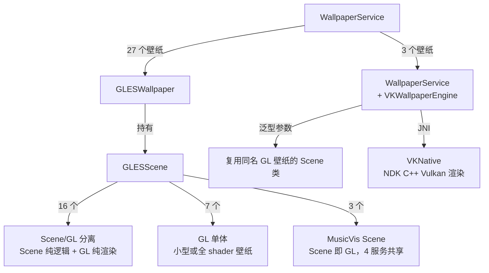
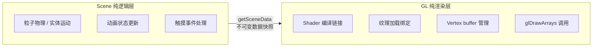
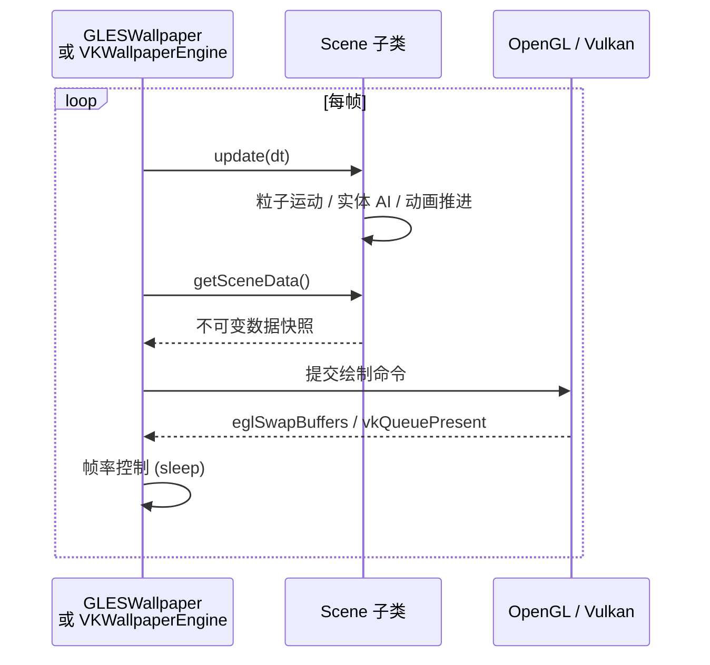
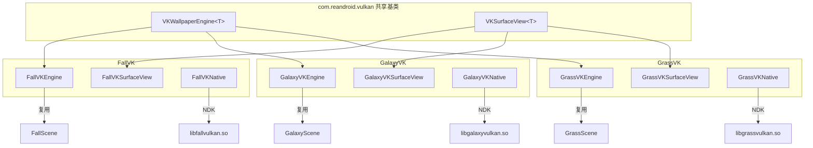

# Reborn Android Live Wallpapers

Android 动态壁纸合集，将 AOSP / MediaTek 经典壁纸从 RenderScript 移植到 OpenGL ES 2.0 和 Vulkan，在新时代 Android 上继续运行

## 壁纸清单

| 壁纸 | 类型 | 渲染路径 | 说明 |
| --- | --- | --- | --- |
| Galaxy | 粒子/星空 | GLES2 + VK | 旋转星场，色彩渐变 |
| Galaxy4 | 粒子/星空 | GLES2 | 旋转星场，色彩渐变 |
| NightSky | 粒子/星空 | GLES2 | 依巴谷星表 9000 真实恒星，陀螺仪追踪，长按加速星轨 |
| Microbes | 粒子/星空 | GLES2 | 微生物群体 AI，触摸投喂，繁殖/死亡循环 |
| Grass | 自然/环境 | GLES2 + VK | 风吹草动，日食/月相/天气联动 |
| WildWorld | 自然/环境 | GLES2 | 远古世界，火山/恐龙/翼龙/火球 |
| WalkAround | 自然/环境 | GLES2 | 透视 |
| DeepSea | 自然/环境 | GLES2 | 深海水母群，陀螺仪追踪 |
| BlueSea | 自然/环境 | GLES2 | 水母漂浮，粒子上升，触摸点亮 |
| Fall | 自然/环境 | GLES2 + VK | 秋叶飘落，水面涟漪 |
| Ocean | 天气 | GLES2 | 海洋天气壁纸，波浪/云层/降水 |
| Windmill | 天气 | GLES2 | 风车天气壁纸 |
| Nexus | 程序化特效 | GLES2 | 脉冲光晕 |
| PhaseBeam | 程序化特效 | GLES2 | 相位光束，HSL 调色 |
| NoiseField | 程序化特效 | GLES2 | Perlin 噪声粒子，触摸扰动 |
| HoloSpiral | 程序化特效 | GLES2 | 全息螺旋，3D 透视旋转 |
| MagicSmoke | 程序化特效 | GLES2 | 多层烟雾叠加 |
| Aurora1 | 极光 | GLES2 | 北极光，99 帧光晕动画 |
| Aurora2 | 极光 | GLES2 | 北极光第二版，更加绚烂 |
| Fireworks | 特效 | GLES2 | 烟花粒子，触摸发射 |
| PolarClock | 时钟 | GLES2 | 极地时钟 |
| MusicVis 2–5 | 音乐可视化 | GLES2 | 4 种音频频谱可视化风格 |
| Galaxy VK | 粒子/星空 | Vulkan | Galaxy 的 Vulkan 变体 |
| Grass VK | 自然/环境 | Vulkan | Grass 的 Vulkan 变体 |
| Fall VK | 自然/环境 | Vulkan | Fall 的 Vulkan 变体 |

**共 30 个壁纸服务：27 个 GLES2 + 3 个 Vulkan**

## 核心架构

### 包结构

```
com.reandroid
├── gles/           GLESWallpaper / GLESScene / GLESPreviewView
├── vulkan/         VKWallpaperEngine / VKSurfaceView       ← 共享 Vulkan 基类
├── settings/       统一设置 UI（51 个文件，每壁纸独立 Fragment）
├── weather/        OpenWeather API 数据层
└── wallpaper/      所有壁纸实现（按子包划分）
    ├── weatherwallpapers/  Ocean / Windmill（天气联动壁纸）
    ├── musicvis/           音乐可视化（4 个 WallpaperService 共享 3 个 Scene）
    └── ......
```

### 渲染路径



### Scene/GL 分离模式

16 个壁纸采用 Scene（纯逻辑）+ GL（纯渲染）分离：

- **Scene 类**：`package-private final class`，负责物理模拟、动画状态、实体管理，不持有 GL 资源
- **GL 类**：`public class extends GLESScene`，负责 shader 编译、纹理加载、绘制调用，不包含业务逻辑



已分离的 16 个壁纸：Aurora1、Aurora2、DeepSea、Fall、Fireworks、Galaxy、Galaxy4、Grass、MagicSmoke、Microbes、Nexus、NightSky、Ocean、PhaseBeam、WildWorld、Windmill

7 个 GL 单体壁纸（BlueSea、HoloSpiral、NoiseField、PolarClock、WalkAround.......）本身代码量较小或有大量 shader 驱动渲染

### 渲染循环



### Vulkan 路径

3 个壁纸（Fall、Galaxy、Grass）提供 Vulkan 后端变体，共享`VKWallpaperEngine<T>`和`VKSurfaceView<T>`泛型基类：



- 基类封装线程管理、Surface 生命周期、帧率诊断（ANR 阈值 200ms）
- 子类仅实现 8 个模板方法（`ensureScene`、`ensureRenderer`、`renderFrame` 等）
- 复用同名 GL 壁纸的 Scene 纯逻辑类，无需重写仿真代码

### 天气集成

`WeatherManager`异步获取 OpenWeatherMap 数据，供 Grass、Windmill、Ocean 动态改变天空、草色、云层、降水、雾效需用户自行配置 API Key

### 设置系统

`SettingsActivity`统一入口 → 壁纸网格列表 → 各自`PreferenceFragment`，支持实时预览、亮度/速度/粒子数量等参数调节、一键恢复默认（`SettingsResetHelper`）全局帧率设置对所有壁纸生效

## 构建配置

### 环境要求

- Android Studio（最新稳定版）
- JDK 17
- Android SDK Platform 33
- Android NDK 25.2.9519653（项目固定版本）
- minSdk 19 / targetSdk 33

### 构建

```bash
# Debug
./gradlew assembleDebug

# Release（自动递增版本号）
./gradlew assembleRelease
```

Vulkan 壁纸需要 `arm64-v8a`、`armeabi-v7a`、`x86_64`、`x86`运行NDK 编译在`preBuild`阶段自动触发

### 项目结构

```
app/src/main/
├── java/com/reandroid/
│   ├── gles/              GLES 框架基类
│   ├── vulkan/            Vulkan 框架基类
│   ├── settings/          设置 UI（Activity + Fragment + 工具类）
│   ├── weather/           天气数据层
│   └── wallpaper/         所有壁纸（按子包划分）
├── res/
│   ├── drawable/          524 张纹理资源
│   ├── raw/               GLSL shader + CSV 网格数据
│   ├── xml/               壁纸服务声明 + 偏好页面（各 ~55 个）
│   ├── values/            字符串（12 种语言）、主题、配置
│   └── layout/            设置页布局
├── jni/                   Vulkan NDK C++ 源码（fallvk / galaxyvk / grassvk）
├── jniLibs/               Vulkan .so 产物
└── shaders/               Vulkan SPIR-V shader（20 个）
```

## 许可证

[LICENSE](LICENSE) · [NOTICE](NOTICE.md)
