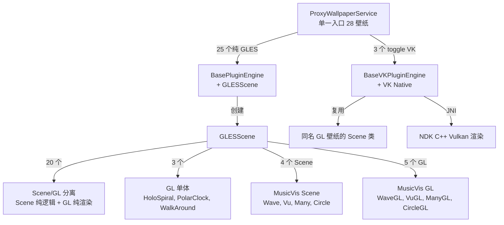
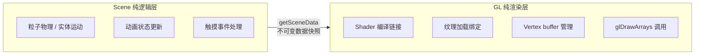
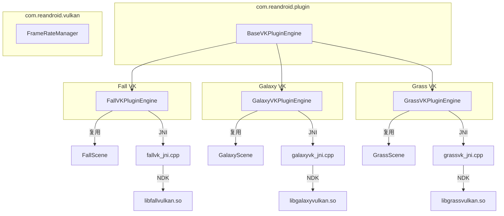

# Reborn Android Live Wallpapers

[English](README-en.md)

Android 动态壁纸合集，将 AOSP / MediaTek 经典壁纸从 RenderScript 移植到 OpenGL ES 2.0 和 Vulkan，在新时代 Android 上继续运行。

>  **快速导航**：[用户使用](#用户指南) · [天气配置](#天气配置) · [音乐可视化](#音乐可视化) · [权限说明](#权限说明) · [性能参考](#性能参考) · [常见问题](#常见问题)　|　[开发者文档](#开发文档)

---

# 用户指南

## 安装使用

**下载安装**
1. 从 [GitHub Releases](../../releases) [ApkPure](https://apkpure.com/p/com.reandroid.wallpaper)下载 APK
2. 允许浏览器/文件管理器的"安装未知应用"权限后安装
3. 支持 Android 4.4（API 19）及以上系统，推荐在AndroidX及以上系统安装

**设置为壁纸**

方法一（推荐）：打开应用 → 选择壁纸 → 进入设置页 → 点击"打开系统预览"

方法二：打开应用 → 打开壁纸选择器 → 找到"REAndroid 动态壁纸"（中国手机系统由于深度定制无法使用此方法）

方法三：系统桌面长按 → 背景 → 找到"REAndroid 动态壁纸"（中国手机系统由于深度定制无法使用此方法）

> 方法一会跳过系统壁纸选择器，直接预览。MIUI 用户首次设置时会弹出权限引导。

**每个壁纸有独立的设置选项** — 粒子数量、颜色、动画速度等都可调整。设置实时预览在页面顶部。

## 壁纸清单

共 **28 个**壁纸，**3 个**（Galaxy、Grass、Fall）额外提供 Vulkan 后端

| 壁纸 | 类型 | VK | 说明 |
| --- | --- | --- | --- |
| Galaxy | 星空 | ✓ | 旋转星场，色彩渐变 |
| Galaxy4 | 星空 | | 旋转星场，色彩渐变 |
| NightSky | 星空 | | 依巴谷星表 9000 真实恒星，陀螺仪追踪，长按加速星轨 |
| Microbes | 粒子 | | 微生物群体 AI，触摸投喂食物，繁殖/死亡循环 |
| Grass | 自然 | ✓ | 风吹草动，日食/月相，支持天气联动 |
| WildWorld | 自然 | | 远古世界，火山/恐龙/翼龙/火球 |
| WalkAround | 自然 | | 相机透视，所见即所得 |
| Cube | 3D | | 8 种线框形状，3D 旋转，触摸拖拽 |
| Forest | 自然 | | 森林视差滚动 |
| DeepSea | 自然 | | 深海水母群，陀螺仪追踪视角 |
| BlueSea | 自然 | | 水母漂浮，粒子上升，触摸点亮 |
| Fall | 自然 | ✓ | 秋叶飘落，水面涟漪 |
| Ocean | 天气 | | 海洋天气壁纸，波浪/云层/降水联动 |
| Windmill | 天气 | | 风车天气壁纸，根据天气改变风车转速和天空 |
| Nexus | 特效 | | 脉冲光晕 |
| PhaseBeam | 特效 | | 相位光束，HSL 调色 |
| NoiseField | 特效 | | Perlin 噪声粒子，触摸产生扰动 |
| HoloSpiral | 特效 | | 全息螺旋，3D 透视旋转 |
| MagicSmoke | 特效 | | 多层烟雾叠加，迷幻效果 |
| Aurora1 | 极光 | | 北极光，99 帧光晕动画 |
| Aurora2 | 极光 | | 北极光第二版，色彩更加绚烂 |
| Fireworks | 特效 | | 烟花粒子，触摸发射烟花 |
| PolarClock | 时钟 | | 极地时钟，三种调色板风格 |
| vis2 | 音乐 | | 音频频谱可视化 — FFT 波形 |
| vis3 | 音乐 | | 音频频谱可视化 — PCM 波形 |
| vis4 | 音乐 | | 音频可视化 — VU 表头风格 |
| vis5 | 音乐 | | 音频可视化 — 波形 + VU 组合 |
| vis6 | 音乐 | | 音频可视化 — 圆形频谱 |

## 功能亮点

与 AOSP/MediaTek 原版壁纸相比：
- **兼容新系统**：原版依赖 RenderScript（Android 12+ 已废弃），这里全部用 GLES/Vulkan 重写
- **独立设置**：每个壁纸有独立的设置页面，调整粒子数、颜色、动画速度等
- **天气联动**：Grass、Ocean、Windmill 可根据真实天气改变画面（需配置 API Key）
- **音乐可视化**：5 种音频频谱风格，播放音乐时壁纸随节奏变化
- **Vulkan 后端**：Galaxy、Grass、Fall 可选 Vulkan 渲染

## 天气配置

Grass（动态草地）、Ocean（海洋天气）、Windmill（风车）三个壁纸支持根据真实天气改变画面效果：晴天阳光明媚、阴天云层加厚、下雨/下雪有粒子效果。

**配置步骤：**

1. 打开 [OpenWeatherMap 注册页](https://home.openweathermap.org/users/sign_up)，注册免费账号
2. 登录后进入 [API Keys](https://home.openweathermap.org/api_keys)，复制默认 Key
3. 打开应用 → 点击工具栏的天气图标 → "OpenWeather API Key" → 粘贴 Key → 确定
4. 回到主页面，天气图标应显示当前天气状况

> 免费额度为每天 1000 次调用，默认每 30 分钟更新一次（可在 "更新间隔" 中改为 15/30/60/180 分钟）。如果不想注册，天气壁纸仍然可以正常使用，只是不会随真实天气变化。

**调试**：长按天气图标可手动覆盖天气状态（晴朗/多云/雨/雪等 10 种），方便测试壁纸在不同天气下的表现。

## 音乐可视化

vis2–vis6 是 5 种音频频谱可视化壁纸，播放音乐时壁纸会随音频节奏动态变化。

**使用方法：**
1. 选择 vis2–vis6 任意一个设为壁纸
2. 授予"录制音频"权限（仅用于读取音频频谱，不保存任何音频数据）
3. 播放手机上的音乐或视频
4. 壁纸会自动随音频变化

| 插件 | 风格 | 模式 | 特点 |
| --- | --- | --- | --- |
| vis2 | 彩色波形 | FFT 频谱 | 多段频谱柱状图，HSL 渐变 |
| vis3 | 彩色波形 | PCM 波形 | 连续波形曲线，更平滑 |
| vis4 | VU 表头 | PCM | 经典音频电平表，指针摆动 |
| vis5 | 组合视图 | FFT | 3D旋转 |
| vis6 | 环形频谱 | FFT | 360° 环绕频谱 |

> Android 系统限制音频捕获采样率。 AndroidX以上需要额外授权才能捕获系统音频。

## 权限说明

应用申请的权限及其原因：

| 权限 | 使用者 | 原因 | 可选 |
| --- | --- | --- | --- |
| 存储读取 | Fireworks（自定义背景） | 选择本地图片作为烟花背景 | ✓ |
| 定位（精确/粗略） | Grass、NightSky | 根据地理位置计算精确的日出日落时间等等 | ✓ |
| 相机 | WalkAround | 将相机画面作为壁纸背景（透视效果） | ✓ |
| 录音 | vis2–vis6 | 捕获系统音频输出用于频谱可视化 | ✓ |
| 网络 | 天气、更新检查 | 获取天气数据、检查版本更新 | ✓ |
| 动态壁纸服务 | 系统 | Android 动态壁纸必需权限 | × |

> ✓ = 可选，拒绝不影响壁纸基本功能　× = 某些系统必需

## 性能参考

不同壁纸的硬件消耗差异较大，供参考：

| 级别 | 壁纸 | 说明 |
| --- | --- | --- |
| 低功耗 | PolarClock, HoloSpiral, Forest | 静态为主，仅少量动画更新 |
| 中等 | Ocean, Windmill, Aurora1/2, Cube, DeepSea, BlueSea, Nexus, PhaseBeam, NoiseField, MagicSmoke, WalkAround, WildWorld | 有持续动画或粒子，但负载可控 |
| 高功耗 | Galaxy, Galaxy4, NightSky, Microbes, Grass, Fall, Fireworks, vis2–6 | 大量粒子/实体 AI/音频实时处理 |

**省电：**
- 通过壁纸设置页降低粒子数量、减少草叶数等
- 全局帧率设置为 30 FPS（设置页右上角菜单 → 全局帧率）
- Galaxy/Grass/Fall 可尝试开启 Vulkan 渲染
- 天气联动功能可以关闭（Grass 设置页 → 关闭"启用天气效果"）

## 常见问题

**Q: 无法打开壁纸预览界面**
MIUI/HyperOS 用户需要在系统设置中授予"动态壁纸服务"权限。应用首次检测到 MIUI 会自动弹出引导。

**Q: 天气不显示 / 显示不正确？**
检查：① OpenWeather API Key 是否正确填入 ② 是否给予位置权限 ③ 网络是否正常，部分地区、运营商无法访问OpenWeather ④ 免费额度是否用完（1000 次/天）长按天气图标可查看上次刷新时间

**Q: Vulkan 开关为什么看不到？**
只有 Galaxy、Grass、Fall 三个壁纸有 Vulkan 后端。如果你的设备不支持 Vulkan，开关虽然可见但切换后可能无效果或崩溃。

**Q: 音乐可视化没有反应？**
确认：① 已授予录音权限 ② 正在播放音频（媒体音量不为零）

**Q: 全局帧率设置多少合适？**
默认 60 FPS 适合大多数设备。低端机建议 24 FPS。高刷新率屏幕可选 90/120 FPS。注意：帧率越高越耗电。

---

# 开发文档

## 核心架构

### 插件三层接口

每个壁纸实现三个接口，由 ProxyWallpaperService 驱动生命周期：

```
WallpaperPlugin          → 插件工厂：getId() / createEngine() / release()
WallpaperEngine          → 渲染引擎：onCreate() / drawFrame() / onSurfaceChanged() / onTouchEvent() ...
WallpaperPluginHost      → 宿主机服务：getSharedPreferences() / getContext() / requestRender()
```

- **WallpaperPlugin** — 无参构造函数，由 ProxyWallpaperService 通过 `Class.forName()` 反射实例化
- **WallpaperEngine** — 管理自己的 EGL/Vulkan 上下文，接收所有 Surface 生命周期回调
- **WallpaperPluginHost** — 提供 `plugin_{id}` 隔离 SharedPreferences 和 ApplicationContext

### ProxyWallpaperService 调度逻辑

```
用户选择壁纸 → setActivePlugin(ctx, pluginId) → 写入 proxy_wallpaper prefs
系统创建壁纸 → ProxyWallpaperService.onCreateEngine()
  → 读取 pluginId
  → 打开 assets/{pluginId}/info.json → 读取 plugin 类名
  → 检查 plugin_{pluginId} prefs 中 use_vulkan 开关
  → 如果 VK=true 且 info.json 有 pluginVk 字段 → 使用 VK 类名
  → Class.forName() 实例化 WallpaperPlugin
  → plugin.createEngine(context, host) 创建 WallpaperEngine
  → ProxyEngine 转发所有 Surface 回调到 WallpaperEngine
```

### 语言资源解析链

设置页面的控件标签翻译来源是 `assets/{pluginId}/language/{locale}.json`，解析优先级：

1. 全 locale tag（如 `zh-rCN`）→ `PluginResources.loadLanguage(ctx, pluginId, "zh-rCN")`
2. 仅语言代码（如 `zh`）→ `loadLanguage(ctx, pluginId, "zh")`
3. 默认英文 → `loadLanguage(ctx, pluginId, "default")`

`layout.json` 中的 `title` / `summary` 字段存储的是 **language JSON 的 lookup key**（如 `"pref_grass_enabled"`），不是显示文本，也不是 `@string/` 引用。`DynamicPreferenceFactory` 先调 `resolveLang()` 查 language JSON，再调 `resolveStringRef()` 兜底处理残留的 `@string/` 引用。

### info.json Schema

每个 `assets/{pluginId}/info.json`：

```json
{
  "label": "@string/wallpaper_xxx",
  "plugin": "com.reandroid.wallpaper.xxx.XxxPlugin",
  "pluginVk": "com.reandroid.wallpaper.xxx.XxxVKPlugin",
  "previewClass": "com.reandroid.wallpaper.xxx.XxxGL",
  "permissions": ["ACCESS_FINE_LOCATION", "CAMERA"],
  "useLegacySettings": false
}
```

| 字段 | 必需 | 说明 |
| --- | --- | --- |
| `label` | ✔ | 壁纸显示名称（可 `@string/` 引用） |
| `plugin` | ✔ | GLES 插件类全限定名 |
| `pluginVk` | | Vulkan 插件类全限定名（有此字段时设置页显示 VK 开关） |
| `previewClass` | | 设置页实时预览的 GL 类（建议填写，提升体验） |
| `permissions` | | 运行时权限列表，API 常量名 |
| `useLegacySettings` | | `true` 时使用独立设置 Activity（仅 PolarClock） |

### layout.json Schema

每个 `assets/{pluginId}/layout.json`：

```json
{
  "prefs": [
    {
      "type": "switch",
      "key": "pref_xxx_enabled",
      "title": "pref_xxx_enabled",
      "summary": "pref_xxx_desc",
      "default": true,
      "min": 0, "max": 100,
      "values": ["a", "b"],
      "labels": ["A", "B"],
      "dependency": "parent_key",
      "disableOn": "parent_key",
      "action": "pickBackground"
    }
  ]
}
```

| 字段 | 适用类型 | 说明 |
| --- | --- | --- |
| `type` | 全部 | `switch` / `seekbar` / `list` / `button` |
| `key` | 全部 | SharedPreferences 键名 |
| `title` | 全部 | language JSON lookup key |
| `summary` | 全部 | language JSON lookup key（可选） |
| `default` | 全部 | 默认值（switch: bool, seekbar/list: 数字或字符串） |
| `min`, `max` | seekbar | 取值范围 |
| `values` | list | 存储值数组 |
| `labels` | list | 显示标签数组（可 `@string/` 引用，也支持 `{key}_label_{value}` 模式） |
| `dependency` | 全部 | 父开关为 true 时才可用 |
| `disableOn` | 全部 | 父开关为 true 时禁用（与 dependency 相反） |
| `action` | button | `pickBackground`（图片选择）或 `resetBackground`（恢复默认） |

### 包结构

```
com.reandroid
├── gles/           GLESWallpaper / GLESScene / GLESPreviewView
├── plugin/         ProxyWallpaperService / BasePluginEngine / BaseVKPluginEngine
│                   WallpaperPlugin / WallpaperEngine / WallpaperPluginHost
│                   PluginSettingsFragment / PluginResources / DynamicPreferenceFactory
├── vulkan/         VKWallpaperEngine / VKSurfaceView / FrameRateManager
├── utils/          AssetLoader / GLTextureUtils / MathUtils / RawResourceLoader
├── settings/       SettingsActivity / SettingsMainFragment / PluginSettingsActivity
│                   PreviewPreference / WallpaperSettings / MiuiPermissionHelper
├── weather/        WeatherManager / WeatherCondition / WeatherState
├── update/         UpdateHelper / UpdateChecker / UpdateDownloader / VersionInfo
└── wallpaper/      31 Plugin + 31 Engine + 24 Scene + 27 GL（按子包划分）
    ├── weatherwallpapers/  Ocean / Windmill
    ├── musicvis/           5 个音乐可视化插件，共享 Scene/GL/资产
    └── ......
```

### 渲染路径



### Scene/GL 分离模式

20 个壁纸采用 Scene（纯逻辑）+ GL（纯渲染）分离：

- **Scene 类**：`package-private final class`，负责物理模拟、动画状态、实体管理，零 Android/GL 导入
- **GL 类**：`public class extends GLESScene`，负责 shader 编译、纹理加载、绘制调用，不包含业务逻辑
- **Mat4**：纯 Java 矩阵运算（`orthoM`、`frustumM`、`translateM`、`rotateM`、`multiplyMM`），替代 `android.opengl.Matrix`，使 Scene 类保持零 Android 依赖



20 个 Scene/GL 分离壁纸：Aurora1、Aurora2、BlueSea、Cube、DeepSea、Fall、Fireworks、Forest、Galaxy、Galaxy4、Grass、MagicSmoke、Microbes、Nexus、NightSky、NoiseField、Ocean、PhaseBeam、WildWorld、Windmill

4 个 MusicVis Scene 类供 5 个插件共享：WaveScene（vis2 FFT + vis3 PCM）、VuScene（vis4）、ManyScene（vis5 → WaveScene + VuScene 组合）、CircleScene（vis6）

3 个 GL 单体壁纸：HoloSpiral（螺旋数学）、PolarClock（调色板系统）、WalkAround（相机直通 — 无可提取逻辑）

### 预置注入

插件引擎通过反射将 `plugin_{id}` 隔离 SharedPreferences 注入 Scene 对象：

1. `BasePluginEngine.tryInjectPrefs()` / `BaseVKPluginEngine` 构造函数调用
2. 通过反射调用 `scene.setPluginPrefs(SharedPreferences)`
3. Scene 内的 `WallpaperSettings.getXxx()` 优先读取注入的 prefs
4. ProGuard 规则保留 `setPluginPrefs` 方法不被混淆

### GLES 渲染引擎

BasePluginEngine 封装 EGL 上下文管理和**延迟初始化**：

```
onSurfaceChanged (main thread)
  → 仅存储 surface / resources / preview 到待处理字段
  → mSceneInitPending = true

首次 drawFrame (render thread, EGL 已 current)
  → if mSceneInitPending:
      → mScene.init(surface, resources, preview)  // GL 命令可安全执行
      → mScene.resize(width, height)
      → mScene.start()
      → mSceneInitPending = false
```

这解决了 `onSurfaceChanged` 在主线程调用但 GL 操作必须在 render thread 执行的问题。

### Vulkan 路径

3 个壁纸（Fall、Galaxy、Grass）提供 Vulkan 后端，通过 `BaseVKPluginEngine` 实现 `WallpaperEngine` + `Runnable`，自管渲染线程。复用同名 GL 壁纸的 Scene 纯逻辑类。



- `BaseVKPluginEngine`（`com.reandroid.plugin`）封装线程管理、Surface 生命周期、帧率诊断
- 子类实现模板方法：`createRenderer()`、`destroyRenderer()`、`onSurfaceCreatedNative()`、`renderFrame()`、`uploadTextures()`
- Native 代码通过 [vk_common.h](app/src/main/jni/vk_common.h) CRTP 模板共享基础设施：679 + 1176 + 1321 + 1540 = **4716** 行
- `FrameRateManager` 提供共享 FPS 控制与 ANR 诊断（阈值 200ms，每 120 帧统计一次）
- `vkArgbToRgba()` 转换 Android ARGB → Vulkan RGBA 字节序
- Swapchain 格式使用 UNORM（非 SRGB）避免双重伽马校正

### MusicVis 架构

5 个音乐可视化插件共享 4 个 Scene 类和 4 个 GL 类：

| 插件 | Scene | GL | 音频模式 |
| --- | --- | --- | --- |
| vis2 | WaveScene | MusicVisWaveGL | FFT |
| vis3 | WaveScene | MusicVisWaveGL | PCM |
| vis4 | VuScene | MusicVisVuGL | PCM |
| vis5 | ManyScene（WaveScene + VuScene 组合） | MusicVisManyGL | FFT |
| vis6 | CircleScene | MusicVisCircleGL | FFT |

- **AudioVisBase** — 抽象基类，管理 AudioCapture 生命周期、HSL 重着色、预置
- **AudioCapture** — 双缓冲 Visualizer 捕获：`mRawBufferA/B` + `mReadyRawBuffer`，捕获线程写、渲染线程读，无锁交换；3 秒空闲超时自动停止
- **ManyScene** — WaveScene + VuScene 实例组合，非继承

### 共享资产

两个跨壁纸的共享资产目录（不归单个壁纸所有）：

- [assets/musicvis/](app/src/main/assets/musicvis/) — 10 个 GLSL shader、10 张纹理（VU 表头/帧/指针/峰值）、1 个 quad UV CSV，供 5 个 MusicVis 插件共享
- [assets/weatherwallpapers/common/drawable/](app/src/main/assets/weatherwallpapers/common/drawable/) — 85 张天气纹理（云/雨/雪/闪电/雾/太阳/水滴动画帧序列），供 Ocean + Windmill 共享

### 设置系统

`SettingsActivity` 统一入口 → 2 列网格壁纸列表（自动从 `assets/*/info.json` 发现）→ 通用 `PluginSettingsFragment`（`layout.json` 驱动）。

- 实时预览 / Vulkan 开关 / 自定义背景 / 依赖互斥 / 恢复默认
- 全局帧率（overflow menu → 8 档可选）/ 预览比例 / Reset All
- 天气按钮（单击 PopupMenu / 长按调试弹窗）
- 自动权限请求 / MIUI 适配 / ThemeOverlay 主题弹窗
- 24h 缓存更新检查（中英文 changelog）

### 测试活动

Manifest 声明 8 个 `CATEGORY_TEST` 活动，可用于 adb 单独启动壁纸调试：

```
Grass / GrassVK / Aurora1 / Aurora2 / Galaxy / GalaxyVK / Fall / FallVK
```

每个通过 `res/values/config.xml` 中的 `config_enable_*_wallpaper` bool 控制启用。

### ProGuard 反射规则

```proguard
-keepclasseswithmembernames class * { native <methods>; }
-keep public class * extends android.service.wallpaper.WallpaperService
-keep public class * extends android.app.Activity
-keep public class * extends androidx.preference.PreferenceFragmentCompat
-keepclassmembers class * extends com.reandroid.gles.GLESScene {
    public void setPluginPrefs(android.content.SharedPreferences);
}
```

## 项目结构

```
app/src/main/
├── java/com/reandroid/
│   ├── gles/              GLES 框架基类
│   ├── plugin/            插件架构核心
│   ├── vulkan/            Vulkan 工具类
│   ├── utils/             工具类
│   ├── settings/          设置 UI
│   ├── weather/           天气数据层
│   ├── update/            更新系统
│   └── wallpaper/         所有壁纸（31 Plugin + 31 Engine + 24 Scene + 27 GL）
├── assets/
│   ├── {wallpaper}/        每个壁纸独立资产（28 个）
│   │   ├── drawable/        纹理图片
│   │   ├── shaders/GLES/    GLSL 着色器
│   │   ├── data/            CSV 网格/顶点数据
│   │   ├── language/        每壁纸多语言 JSON（13 种语言）
│   │   ├── info.json        插件元数据
│   │   └── layout.json      动态偏好界面定义
│   ├── musicvis/            MusicVis 5 插件共享资产
│   └── weatherwallpapers/   Ocean + Windmill 共享天气纹理（85 张）
├── res/
│   ├── xml/               5 个 XML 配置
│   ├── values/            字符串（13 种语言）/ 主题 / config.xml
│   ├── values-night/      暗色主题
│   ├── layout/            设置页布局（8 个）
│   ├── drawable/          天气图标 / 启动图标
│   └── menu/              2 个菜单
├── jni/                   Vulkan NDK C++ 源码（4 个文件 + Android.mk）
├── jniLibs/               Vulkan 预编译 .so（4 架构 × 3 = 12 个）
└── shaders/               Vulkan GLSL 着色器源码（构建时编译为 SPIR-V）
```

## 构建配置

### 环境要求

- Android Studio（最新稳定版）
- JDK 17
- Android SDK Platform 33
- Android NDK 25.2.9519653（项目固定版本）
- minSdk 19 / targetSdk 33

### 构建

```bash
# Debug
./gradlew assembleDebug

# Release（自动递增版本号）
./gradlew assembleRelease
```

Vulkan 壁纸需要 `arm64-v8a`、`armeabi-v7a`、`x86_64`、`x86`。Native 编译使用 [Android.mk](app/src/main/jni/Android.mk)（ndk-build），在 `preBuild` 阶段自动触发。预编译 `.so` 输出到 [app/src/main/jniLibs/](app/src/main/jniLibs/)。

## 许可证

[LICENSE](LICENSE) · [NOTICE](NOTICE.md)
