# Reborn Android Live Wallpapers

[English](#english) | [简体中文](#简体中文) | [繁體中文](#繁體中文) | [日本語](#日本語) | [한국어](#한국어)

---

## English

# Reborn Android Live Wallpapers

An Android live wallpaper collection that ports classic AOSP / MediaTek wallpapers from RenderScript to OpenGL ES 2.0 and Vulkan, allowing them to run on modern Android versions.

## Wallpaper List

| Wallpaper | Type | Render Path | Description |
| --- | --- | --- | --- |
| Galaxy | Particle / Starfield | GLES2 + VK | Rotating star field with color gradients |
| Galaxy4 | Particle / Starfield | GLES2 | Rotating star field with color gradients |
| NightSky | Particle / Starfield | GLES2 | 9,000 real stars from Hipparcos catalog, gyroscope tracking, long press to accelerate star trails |
| Microbes | Particle / Starfield | GLES2 | Microbial swarm AI, touch feeding, reproduction / death cycle |
| Grass | Nature / Environment | GLES2 + VK | Wind-blown grass, solar/lunar eclipse + weather integration |
| WildWorld | Nature / Environment | GLES2 | Prehistoric world with volcanoes, dinosaurs, pterosaurs, fireballs |
| WalkAround | Nature / Environment | GLES2 | Perspective view |
| DeepSea | Nature / Environment | GLES2 | Deep-sea jellyfish swarm, gyroscope tracking |
| BlueSea | Nature / Environment | GLES2 | Floating jellyfish, rising particles, touch to light up |
| Fall | Nature / Environment | GLES2 + VK | Falling autumn leaves, water ripples |
| Ocean | Weather | GLES2 | Ocean weather wallpaper: waves, clouds, precipitation |
| Windmill | Weather | GLES2 | Windmill weather wallpaper |
| Nexus | Procedural Effects | GLES2 | Pulsed halo |
| PhaseBeam | Procedural Effects | GLES2 | Phase beam, HSL color tuning |
| NoiseField | Procedural Effects | GLES2 | Perlin noise particles, touch perturbation |
| HoloSpiral | Procedural Effects | GLES2 | Holographic spiral, 3D perspective rotation |
| MagicSmoke | Procedural Effects | GLES2 | Multi-layer smoke blending |
| Aurora1 | Aurora | GLES2 | Northern lights, 99-frame glow animation |
| Aurora2 | Aurora | GLES2 | Northern lights v2, more brilliant |
| Fireworks | Effects | GLES2 | Firework particles, touch to launch |
| PolarClock | Clock | GLES2 | Polar clock |
| MusicVis 2–5 | Music Visualization | GLES2 | 4 audio spectrum visualization styles |
| Galaxy VK | Particle / Starfield | Vulkan | Vulkan variant of Galaxy |
| Grass VK | Nature / Environment | Vulkan | Vulkan variant of Grass |
| Fall VK | Nature / Environment | Vulkan | Vulkan variant of Fall |

**Total 30 wallpaper services: 27 GLES2 + 3 Vulkan**

## Core Architecture

### Package Structure

```
com.reandroid
├── gles/           GLESWallpaper / GLESScene / GLESPreviewView
├── vulkan/         VKWallpaperEngine / VKSurfaceView       ← Shared Vulkan base
├── settings/       Unified settings UI (51 files, per-wallpaper Fragment)
├── weather/        OpenWeather API data layer
└── wallpaper/      All wallpaper implementations (grouped by subpackage)
    ├── weatherwallpapers/  Ocean / Windmill (weather-integrated)
    ├── musicvis/           Music visualization (4 services sharing 3 Scenes)
    └── ......
```

### Render Paths

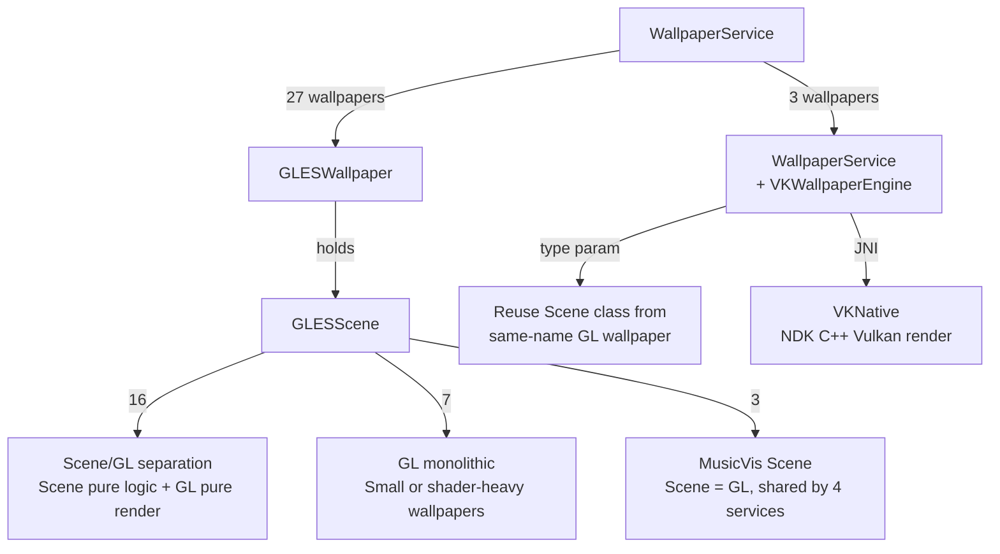

### Scene/GL Separation Pattern

16 wallpapers adopt Scene (pure logic) + GL (pure rendering) separation:

- **Scene class**: `package-private final class`, handles physics, animation state, entity management – no GL resources.
- **GL class**: `public class extends GLESScene`, handles shader compilation, texture loading, drawing calls – no business logic.

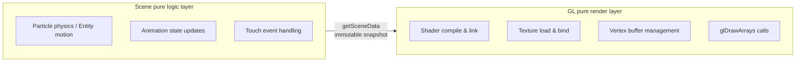

16 separated wallpapers: Aurora1, Aurora2, DeepSea, Fall, Fireworks, Galaxy, Galaxy4, Grass, MagicSmoke, Microbes, Nexus, NightSky, Ocean, PhaseBeam, WildWorld, Windmill.

7 monolithic GL wallpapers (BlueSea, HoloSpiral, NoiseField, PolarClock, WalkAround, …) are small or heavily shader-driven.

### Render Loop

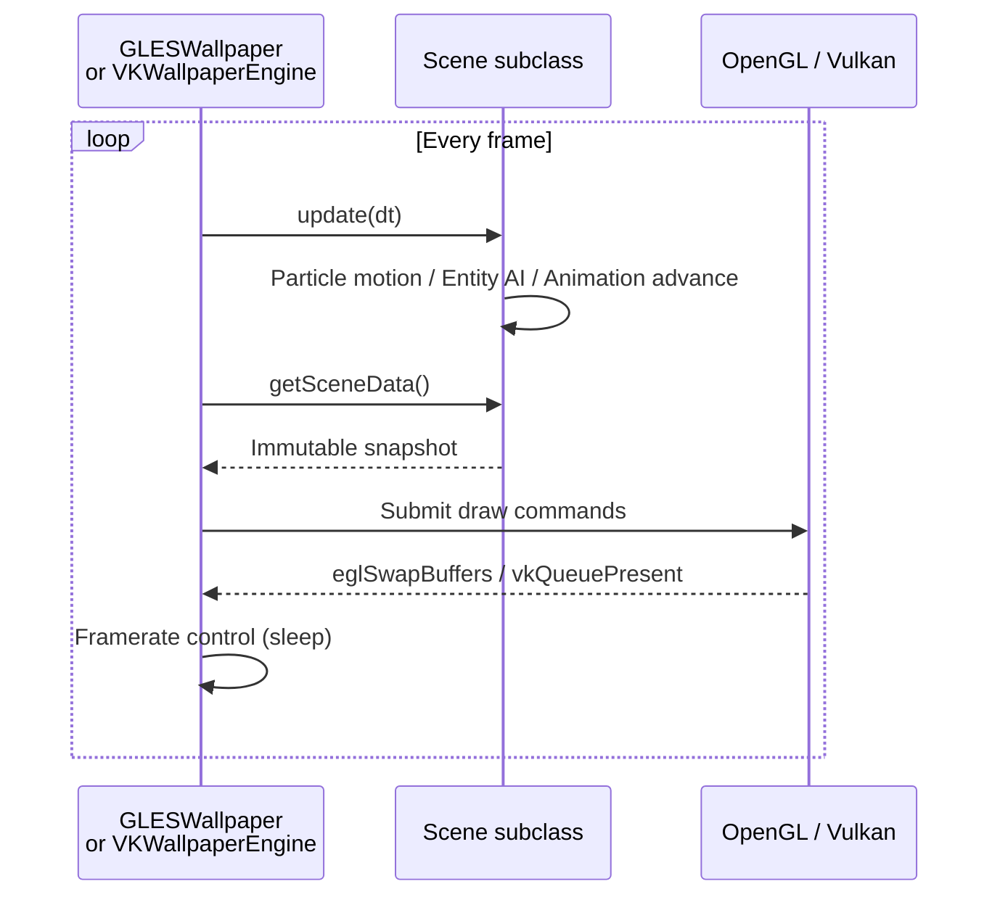

### Vulkan Path

3 wallpapers (Fall, Galaxy, Grass) provide Vulkan backends, sharing `VKWallpaperEngine<T>` and `VKSurfaceView<T>` generic base classes:

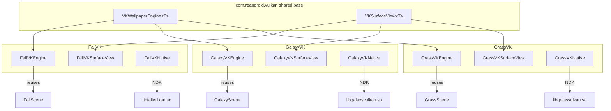

- Base classes encapsulate threading, Surface lifecycle, frame‑rate diagnostics (ANR threshold 200ms).
- Subclasses only implement 8 template methods (`ensureScene`, `ensureRenderer`, `renderFrame`, …).
- Reuse the same Scene logic classes from the GL wallpapers – no need to rewrite simulation code.

### Weather Integration

`WeatherManager` asynchronously fetches OpenWeatherMap data, used by Grass, Windmill, Ocean to dynamically change sky, grass color, clouds, precipitation, fog. Users must provide their own API key.

### Settings System

`SettingsActivity` unified entry → wallpaper grid list → individual `PreferenceFragment`. Supports real‑time preview, brightness/speed/particle count adjustments, one‑click restore defaults (`SettingsResetHelper`). Global framerate setting applies to all wallpapers.

## Build Configuration

### Requirements

- Android Studio (latest stable)
- JDK 17
- Android SDK Platform 33
- Android NDK 25.2.9519653 (fixed)
- minSdk 19 / targetSdk 33

### Build

```bash
# Debug
./gradlew assembleDebug

# Release (auto‑increment version code)
./gradlew assembleRelease
```

Vulkan wallpapers require `arm64-v8a`, `armeabi-v7a`, `x86_64`, `x86`. NDK compilation runs automatically during `preBuild`.

### Project Structure

```
app/src/main/
├── java/com/reandroid/
│   ├── gles/              GLES framework base
│   ├── vulkan/            Vulkan framework base
│   ├── settings/          Settings UI (Activity + Fragment + utilities)
│   ├── weather/           Weather data layer
│   └── wallpaper/         All wallpapers (grouped by subpackage)
├── res/
│   ├── drawable/          524 texture assets
│   ├── raw/               GLSL shaders + CSV mesh data
│   ├── xml/               Wallpaper service declarations + preference pages (~55 each)
│   ├── values/            Strings (12 languages), themes, config
│   └── layout/            Settings layouts
├── jni/                   Vulkan NDK C++ source (fallvk / galaxyvk / grassvk)
├── jniLibs/               Vulkan .so outputs
└── shaders/               Vulkan SPIR-V shaders (20 files)
```

## License

[LICENSE](LICENSE) · [NOTICE](NOTICE.md)

---

## 简体中文
[English](#english) | [简体中文](#简体中文) | [繁體中文](#繁體中文) | [日本語](#日本語) | [한국어](#한국어)
# Reborn Android Live Wallpapers

Android 动态壁纸合集，将 AOSP / MediaTek 经典壁纸从 RenderScript 移植到 OpenGL ES 2.0 和 Vulkan，在新时代 Android 上继续运行

## 壁纸清单

| 壁纸 | 类型 | 渲染路径 | 说明 |
| --- | --- | --- | --- |
| Galaxy | 粒子/星空 | GLES2 + VK | 旋转星场，色彩渐变 |
| Galaxy4 | 粒子/星空 | GLES2 | 旋转星场，色彩渐变 |
| NightSky | 粒子/星空 | GLES2 | 依巴谷星表 9000 真实恒星，陀螺仪追踪，长按加速星轨 |
| Microbes | 粒子/星空 | GLES2 | 微生物群体 AI，触摸投喂，繁殖/死亡循环 |
| Grass | 自然/环境 | GLES2 + VK | 风吹草动，日食/月相/天气联动 |
| WildWorld | 自然/环境 | GLES2 | 远古世界，火山/恐龙/翼龙/火球 |
| WalkAround | 自然/环境 | GLES2 | 透视 |
| DeepSea | 自然/环境 | GLES2 | 深海水母群，陀螺仪追踪 |
| BlueSea | 自然/环境 | GLES2 | 水母漂浮，粒子上升，触摸点亮 |
| Fall | 自然/环境 | GLES2 + VK | 秋叶飘落，水面涟漪 |
| Ocean | 天气 | GLES2 | 海洋天气壁纸，波浪/云层/降水 |
| Windmill | 天气 | GLES2 | 风车天气壁纸 |
| Nexus | 程序化特效 | GLES2 | 脉冲光晕 |
| PhaseBeam | 程序化特效 | GLES2 | 相位光束，HSL 调色 |
| NoiseField | 程序化特效 | GLES2 | Perlin 噪声粒子，触摸扰动 |
| HoloSpiral | 程序化特效 | GLES2 | 全息螺旋，3D 透视旋转 |
| MagicSmoke | 程序化特效 | GLES2 | 多层烟雾叠加 |
| Aurora1 | 极光 | GLES2 | 北极光，99 帧光晕动画 |
| Aurora2 | 极光 | GLES2 | 北极光第二版，更加绚烂 |
| Fireworks | 特效 | GLES2 | 烟花粒子，触摸发射 |
| PolarClock | 时钟 | GLES2 | 极地时钟 |
| MusicVis 2–5 | 音乐可视化 | GLES2 | 4 种音频频谱可视化风格 |
| Galaxy VK | 粒子/星空 | Vulkan | Galaxy 的 Vulkan 变体 |
| Grass VK | 自然/环境 | Vulkan | Grass 的 Vulkan 变体 |
| Fall VK | 自然/环境 | Vulkan | Fall 的 Vulkan 变体 |

**共 30 个壁纸服务：27 个 GLES2 + 3 个 Vulkan**

## 核心架构

### 包结构

```
com.reandroid
├── gles/           GLESWallpaper / GLESScene / GLESPreviewView
├── vulkan/         VKWallpaperEngine / VKSurfaceView       ← 共享 Vulkan 基类
├── settings/       统一设置 UI（51 个文件，每壁纸独立 Fragment）
├── weather/        OpenWeather API 数据层
└── wallpaper/      所有壁纸实现（按子包划分）
    ├── weatherwallpapers/  Ocean / Windmill（天气联动壁纸）
    ├── musicvis/           音乐可视化（4 个 WallpaperService 共享 3 个 Scene）
    └── ......
```

### 渲染路径

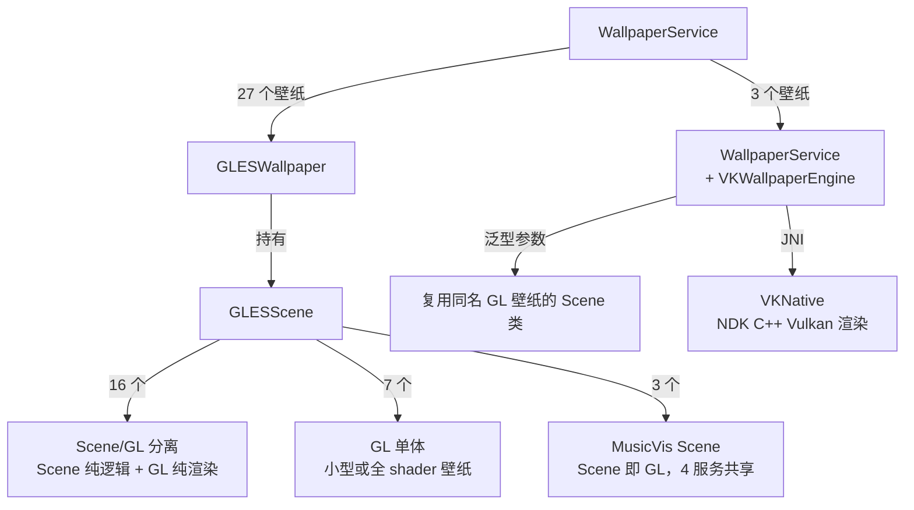

### Scene/GL 分离模式

16 个壁纸采用 Scene（纯逻辑）+ GL（纯渲染）分离：

- **Scene 类**：`package-private final class`，负责物理模拟、动画状态、实体管理，不持有 GL 资源
- **GL 类**：`public class extends GLESScene`，负责 shader 编译、纹理加载、绘制调用，不包含业务逻辑

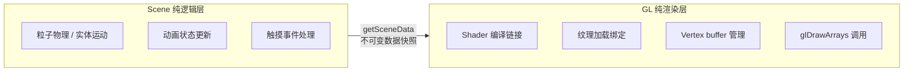

已分离的 16 个壁纸：Aurora1、Aurora2、DeepSea、Fall、Fireworks、Galaxy、Galaxy4、Grass、MagicSmoke、Microbes、Nexus、NightSky、Ocean、PhaseBeam、WildWorld、Windmill

7 个 GL 单体壁纸（BlueSea、HoloSpiral、NoiseField、PolarClock、WalkAround.......）本身代码量较小或有大量 shader 驱动渲染

### 渲染循环

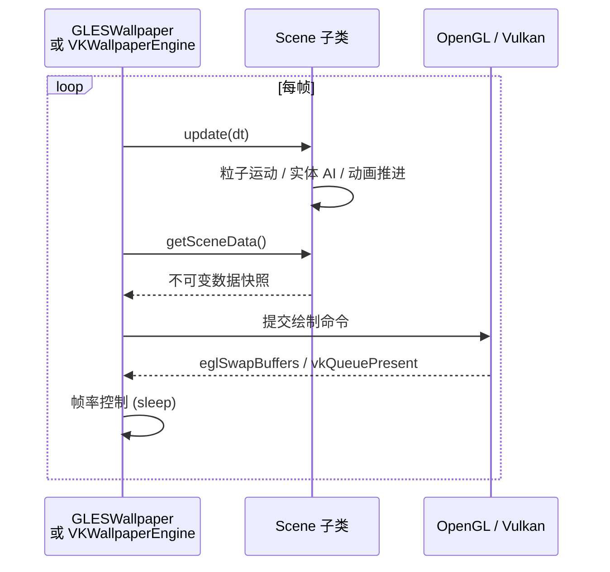

### Vulkan 路径

3 个壁纸（Fall、Galaxy、Grass）提供 Vulkan 后端变体，共享`VKWallpaperEngine<T>`和`VKSurfaceView<T>`泛型基类：

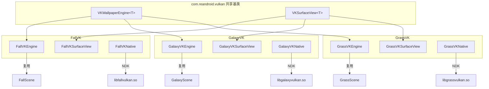

- 基类封装线程管理、Surface 生命周期、帧率诊断（ANR 阈值 200ms）
- 子类仅实现 8 个模板方法（`ensureScene`、`ensureRenderer`、`renderFrame` 等）
- 复用同名 GL 壁纸的 Scene 纯逻辑类，无需重写仿真代码

### 天气集成

`WeatherManager`异步获取 OpenWeatherMap 数据，供 Grass、Windmill、Ocean 动态改变天空、草色、云层、降水、雾效需用户自行配置 API Key

### 设置系统

`SettingsActivity`统一入口 → 壁纸网格列表 → 各自`PreferenceFragment`，支持实时预览、亮度/速度/粒子数量等参数调节、一键恢复默认（`SettingsResetHelper`）全局帧率设置对所有壁纸生效

## 构建配置

### 环境要求

- Android Studio（最新稳定版）
- JDK 17
- Android SDK Platform 33
- Android NDK 25.2.9519653（项目固定版本）
- minSdk 19 / targetSdk 33

### 构建

```bash
# Debug
./gradlew assembleDebug

# Release（自动递增版本号）
./gradlew assembleRelease
```

Vulkan 壁纸需要 `arm64-v8a`、`armeabi-v7a`、`x86_64`、`x86`运行NDK 编译在`preBuild`阶段自动触发

### 项目结构

```
app/src/main/
├── java/com/reandroid/
│   ├── gles/              GLES 框架基类
│   ├── vulkan/            Vulkan 框架基类
│   ├── settings/          设置 UI（Activity + Fragment + 工具类）
│   ├── weather/           天气数据层
│   └── wallpaper/         所有壁纸（按子包划分）
├── res/
│   ├── drawable/          524 张纹理资源
│   ├── raw/               GLSL shader + CSV 网格数据
│   ├── xml/               壁纸服务声明 + 偏好页面（各 ~55 个）
│   ├── values/            字符串（12 种语言）、主题、配置
│   └── layout/            设置页布局
├── jni/                   Vulkan NDK C++ 源码（fallvk / galaxyvk / grassvk）
├── jniLibs/               Vulkan .so 产物
└── shaders/               Vulkan SPIR-V shader（20 个）
```

## 许可证

[LICENSE](LICENSE) · [NOTICE](NOTICE.md)

---

## 繁體中文
[English](#english) | [简体中文](#简体中文) | [繁體中文](#繁體中文) | [日本語](#日本語) | [한국어](#한국어)
# Reborn Android Live Wallpapers

Android 動態桌布合集，將 AOSP / MediaTek 經典桌布從 RenderScript 移植到 OpenGL ES 2.0 和 Vulkan，在新時代 Android 上繼續運行

## 桌布清單

| 桌布 | 類型 | 渲染路徑 | 說明 |
| --- | --- | --- | --- |
| Galaxy | 粒子/星空 | GLES2 + VK | 旋轉星場，色彩漸變 |
| Galaxy4 | 粒子/星空 | GLES2 | 旋轉星場，色彩漸變 |
| NightSky | 粒子/星空 | GLES2 | 依巴谷星表 9000 顆真實恆星，陀螺儀追蹤，長按加速星軌 |
| Microbes | 粒子/星空 | GLES2 | 微生物群體 AI，觸摸餵食，繁殖/死亡循環 |
| Grass | 自然/環境 | GLES2 + VK | 風吹草動，日食/月相/天氣聯動 |
| WildWorld | 自然/環境 | GLES2 | 遠古世界，火山/恐龍/翼龍/火球 |
| WalkAround | 自然/環境 | GLES2 | 透視 |
| DeepSea | 自然/環境 | GLES2 | 深海海母群，陀螺儀追蹤 |
| BlueSea | 自然/環境 | GLES2 | 海母漂浮，粒子上升，觸摸點亮 |
| Fall | 自然/環境 | GLES2 + VK | 秋葉飄落，水面漣漪 |
| Ocean | 天氣 | GLES2 | 海洋天氣桌布，波浪/雲層/降水 |
| Windmill | 天氣 | GLES2 | 風車天氣桌布 |
| Nexus | 程式化特效 | GLES2 | 脈衝光暈 |
| PhaseBeam | 程式化特效 | GLES2 | 相位光束，HSL 調色 |
| NoiseField | 程式化特效 | GLES2 | Perlin 噪聲粒子，觸摸擾動 |
| HoloSpiral | 程式化特效 | GLES2 | 全息螺旋，3D 透視旋轉 |
| MagicSmoke | 程式化特效 | GLES2 | 多層煙霧疊加 |
| Aurora1 | 極光 | GLES2 | 北極光，99 幀光暈動畫 |
| Aurora2 | 極光 | GLES2 | 北極光第二版，更加絢爛 |
| Fireworks | 特效 | GLES2 | 煙火粒子，觸摸發射 |
| PolarClock | 時鐘 | GLES2 | 極地時鐘 |
| MusicVis 2–5 | 音樂可視化 | GLES2 | 4 種音訊頻譜可視化風格 |
| Galaxy VK | 粒子/星空 | Vulkan | Galaxy 的 Vulkan 變體 |
| Grass VK | 自然/環境 | Vulkan | Grass 的 Vulkan 變體 |
| Fall VK | 自然/環境 | Vulkan | Fall 的 Vulkan 變體 |

**共 30 個桌布服務：27 個 GLES2 + 3 個 Vulkan**

## 核心架構

### 套件結構

```
com.reandroid
├── gles/           GLESWallpaper / GLESScene / GLESPreviewView
├── vulkan/         VKWallpaperEngine / VKSurfaceView       ← 共享 Vulkan 基底類別
├── settings/       統一設定 UI（51 個檔案，每桌布獨立 Fragment）
├── weather/        OpenWeather API 資料層
└── wallpaper/      所有桌布實現（按子套件劃分）
    ├── weatherwallpapers/  Ocean / Windmill（天氣聯動桌布）
    ├── musicvis/           音樂可視化（4 個 WallpaperService 共享 3 個 Scene）
    └── ......
```

### 渲染路徑

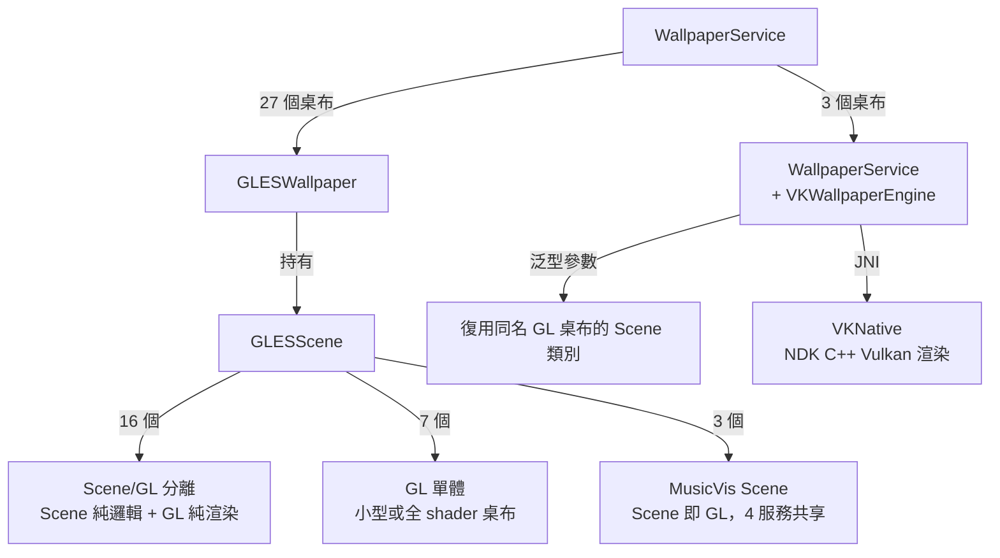

### Scene/GL 分離模式

16 個桌布採用 Scene（純邏輯）+ GL（純渲染）分離：

- **Scene 類別**：`package-private final class`，負責物理模擬、動畫狀態、實體管理，不持有 GL 資源
- **GL 類別**：`public class extends GLESScene`，負責 shader 編譯、紋理載入、繪製呼叫，不包含業務邏輯


已分離的 16 個桌布：Aurora1、Aurora2、DeepSea、Fall、Fireworks、Galaxy、Galaxy4、Grass、MagicSmoke、Microbes、Nexus、NightSky、Ocean、PhaseBeam、WildWorld、Windmill

7 個 GL 單體桌布（BlueSea、HoloSpiral、NoiseField、PolarClock、WalkAround.......）本身程式碼量較小或有大量 shader 驅動渲染

### 渲染迴圈


### Vulkan 路徑

3 個桌布（Fall、Galaxy、Grass）提供 Vulkan 後端變體，共享`VKWallpaperEngine<T>`和`VKSurfaceView<T>`泛型基底類別：

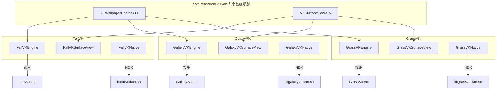

- 基底類別封裝執行緒管理、Surface 生命週期、幀率診斷（ANR 臨界值 200ms）
- 子類別僅需實現 8 個模板方法（`ensureScene`、`ensureRenderer`、`renderFrame` 等）
- 復用同名 GL 桌布的 Scene 純邏輯類別，無需重寫模擬程式碼

### 天氣整合

`WeatherManager`非同步獲取 OpenWeatherMap 資料，供 Grass、Windmill、Ocean 動態改變天空、草色、雲層、降水、霧效。使用者需自行設定 API Key。

### 設定系統

`SettingsActivity`統一入口 → 桌布網格列表 → 各自`PreferenceFragment`，支援即時預覽、亮度/速度/粒子數量等參數調節、一鍵恢復預設（`SettingsResetHelper`）。全域幀率設定對所有桌布生效。

## 建置配置

### 環境要求

- Android Studio（最新穩定版）
- JDK 17
- Android SDK Platform 33
- Android NDK 25.2.9519653（專案固定版本）
- minSdk 19 / targetSdk 33

### 建置

```bash
# Debug
./gradlew assembleDebug

# Release（自動遞增版本號）
./gradlew assembleRelease
```

Vulkan 桌布需要 `arm64-v8a`、`armeabi-v7a`、`x86_64`、`x86`。NDK 編譯在 `preBuild` 階段自動觸發。

### 專案結構

```
app/src/main/
├── java/com/reandroid/
│   ├── gles/              GLES 框架基底類別
│   ├── vulkan/            Vulkan 框架基底類別
│   ├── settings/          設定 UI（Activity + Fragment + 工具類別）
│   ├── weather/           天氣資料層
│   └── wallpaper/         所有桌布（按子套件劃分）
├── res/
│   ├── drawable/          524 張紋理資源
│   ├── raw/               GLSL shader + CSV 網格資料
│   ├── xml/               桌布服務宣告 + 偏好頁面（各約 55 個）
│   ├── values/            字串（12 種語言）、主題、配置
│   └── layout/            設定頁佈局
├── jni/                   Vulkan NDK C++ 原始碼（fallvk / galaxyvk / grassvk）
├── jniLibs/               Vulkan .so 產物
└── shaders/               Vulkan SPIR-V shader（20 個）
```

## 許可證

[LICENSE](LICENSE) · [NOTICE](NOTICE.md)

---

## 日本語
[English](#english) | [简体中文](#简体中文) | [繁體中文](#繁體中文) | [日本語](#日本語) | [한국어](#한국어)
# Reborn Android Live Wallpapers

Android ライブ壁紙コレクション。AOSP / MediaTek のクラシック壁紙を RenderScript から OpenGL ES 2.0 および Vulkan に移植し、新しい Android バージョンでも動作させます。

## 壁紙一覧

| 壁紙 | タイプ | レンダリングパス | 説明 |
| --- | --- | --- | --- |
| Galaxy | パーティクル / 星空 | GLES2 + VK | 回転する星野、カラーグラデーション |
| Galaxy4 | パーティクル / 星空 | GLES2 | 回転する星野、カラーグラデーション |
| NightSky | パーティクル / 星空 | GLES2 | ヒッパルコス星表の9000個の実恒星、ジャイロトラッキング、長押しで星跡加速 |
| Microbes | パーティクル / 星空 | GLES2 | 微生物群集 AI、タッチで餌やり、繁殖／死のサイクル |
| Grass | 自然 / 環境 | GLES2 + VK | 風に揺れる草、日食／月相／天気連動 |
| WildWorld | 自然 / 環境 | GLES2 | 古代世界、火山／恐竜／翼竜／火の玉 |
| WalkAround | 自然 / 環境 | GLES2 | パース表示 |
| DeepSea | 自然 / 環境 | GLES2 | 深海のクラゲ群、ジャイロトラッキング |
| BlueSea | 自然 / 環境 | GLES2 | 浮遊するクラゲ、上昇する粒子、タッチで発光 |
| Fall | 自然 / 環境 | GLES2 + VK | 秋の落葉、水面のさざ波 |
| Ocean | 天気 | GLES2 | 海洋天気壁紙、波／雲／降水 |
| Windmill | 天気 | GLES2 | 風車天気壁紙 |
| Nexus | プログラムエフェクト | GLES2 | パルス状のハロ |
| PhaseBeam | プログラムエフェクト | GLES2 | フェーズビーム、HSLカラー調整 |
| NoiseField | プログラムエフェクト | GLES2 | Perlin ノイズ粒子、タッチで擾乱 |
| HoloSpiral | プログラムエフェクト | GLES2 | ホログラフィックスパイラル、3D パース回転 |
| MagicSmoke | プログラムエフェクト | GLES2 | 多層スモークブレンド |
| Aurora1 | オーロラ | GLES2 | 北極光、99フレームのグローアニメーション |
| Aurora2 | オーロラ | GLES2 | 北極光 第二版、より鮮やか |
| Fireworks | エフェクト | GLES2 | 花火パーティクル、タッチで打ち上げ |
| PolarClock | 時計 | GLES2 | ポーラークロック |
| MusicVis 2–5 | 音楽ビジュアライゼーション | GLES2 | 4種類のオーディオスペクトラム可視化スタイル |
| Galaxy VK | パーティクル / 星空 | Vulkan | Galaxy の Vulkan バリアント |
| Grass VK | 自然 / 環境 | Vulkan | Grass の Vulkan バリアント |
| Fall VK | 自然 / 環境 | Vulkan | Fall の Vulkan バリアント |

**合計30の壁紙サービス：27 GLES2 ＋ 3 Vulkan**

## コアアーキテクチャ

### パッケージ構造

```
com.reandroid
├── gles/           GLESWallpaper / GLESScene / GLESPreviewView
├── vulkan/         VKWallpaperEngine / VKSurfaceView       ← 共有 Vulkan 基底クラス
├── settings/       統一設定 UI（51ファイル、壁紙ごとに独立した Fragment）
├── weather/        OpenWeather API データ層
└── wallpaper/      すべての壁紙実装（サブパッケージで分類）
    ├── weatherwallpapers/  Ocean / Windmill（天気連動壁紙）
    ├── musicvis/           音楽ビジュアライゼーション（4つのサービスで3つの Scene を共有）
    └── ......
```

### レンダリングパス

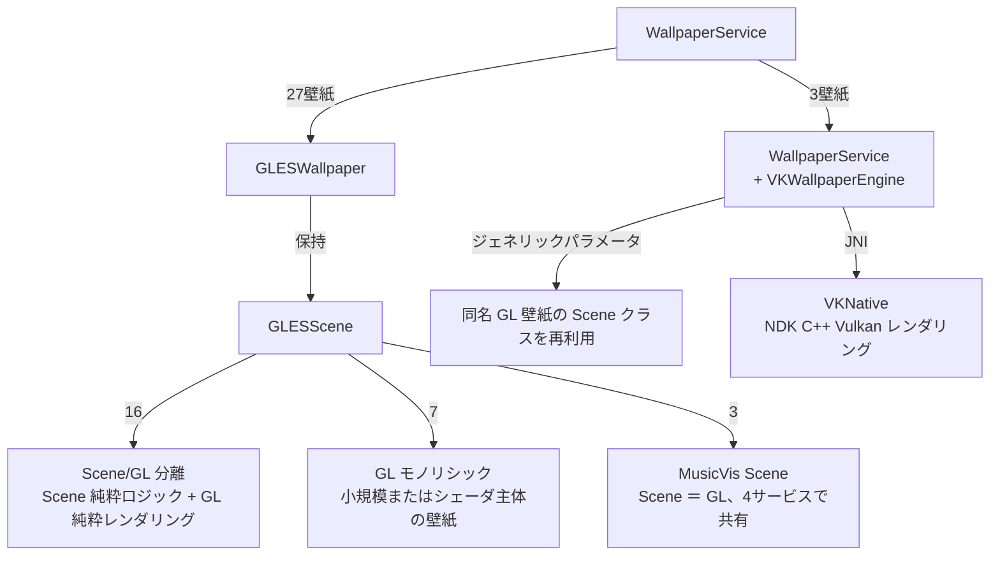

### Scene/GL 分離パターン

16の壁紙が Scene（純粋ロジック）＋ GL（純粋レンダリング）の分離を採用：

- **Scene クラス**：`package-private final class`、物理シミュレーション、アニメーション状態、エンティティ管理を担当。GLリソースを保持しない。
- **GL クラス**：`public class extends GLESScene`、シェーダコンパイル、テクスチャロード、描画呼び出しを担当。ビジネスロジックを含まない。

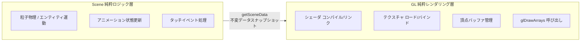

分離済みの16壁紙：Aurora1、Aurora2、DeepSea、Fall、Fireworks、Galaxy、Galaxy4、Grass、MagicSmoke、Microbes、Nexus、NightSky、Ocean、PhaseBeam、WildWorld、Windmill

7つのGLモノリシック壁紙（BlueSea、HoloSpiral、NoiseField、PolarClock、WalkAround...）はコード量が小さいか、シェーダ主体のレンダリングに依存。

### レンダリングループ

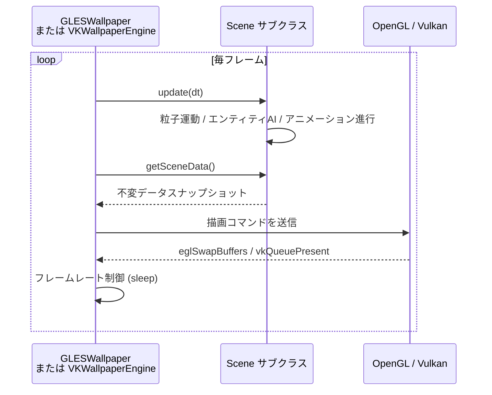

### Vulkan パス

3つの壁紙（Fall、Galaxy、Grass）がVulkanバックエンドのバリアントを提供。`VKWallpaperEngine<T>` と `VKSurfaceView<T>` ジェネリック基底クラスを共有：

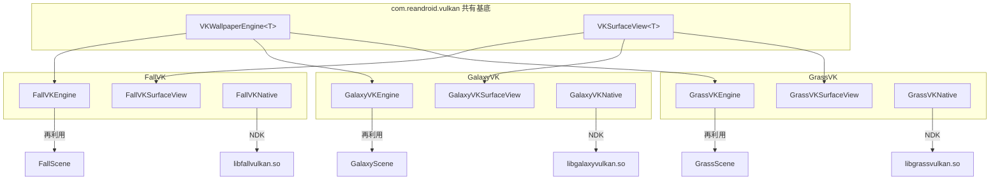

- 基底クラスはスレッド管理、Surfaceライフサイクル、フレームレート診断（ANRしきい値200ms）をカプセル化。
- サブクラスは8つのテンプレートメソッド（`ensureScene`、`ensureRenderer`、`renderFrame` など）のみを実装。
- 同名のGL壁紙のScene純粋ロジッククラスを再利用するため、シミュレーションコードを書き直す必要はない。

### 天気連携

`WeatherManager` が非同期で OpenWeatherMap データを取得。Grass、Windmill、Ocean で空、草の色、雲、降水、フォグを動的に変更するために使用。ユーザー自身でAPIキーの設定が必要。

### 設定システム

`SettingsActivity` 統一エントリ → 壁紙グリッド一覧 → 各 `PreferenceFragment`。リアルタイムプレビュー、明るさ/速度/粒子数などのパラメータ調整、ワンクリックでデフォルトに復元（`SettingsResetHelper`）に対応。グローバルフレームレート設定はすべての壁紙に有効。

## ビルド構成

### 環境要件

- Android Studio（最新安定版）
- JDK 17
- Android SDK Platform 33
- Android NDK 25.2.9519653（プロジェクト固定バージョン）
- minSdk 19 / targetSdk 33

### ビルド

```bash
# Debug
./gradlew assembleDebug

# Release（自動でバージョンコードを増分）
./gradlew assembleRelease
```

Vulkan壁紙には `arm64-v8a`、`armeabi-v7a`、`x86_64`、`x86` が必要。NDKコンパイルは `preBuild` フェーズで自動実行される。

### プロジェクト構造

```
app/src/main/
├── java/com/reandroid/
│   ├── gles/              GLES フレームワーク基底
│   ├── vulkan/            Vulkan フレームワーク基底
│   ├── settings/          設定 UI（Activity + Fragment + ユーティリティ）
│   ├── weather/           天気データ層
│   └── wallpaper/         すべての壁紙（サブパッケージで分類）
├── res/
│   ├── drawable/          524個のテクスチャアセット
│   ├── raw/               GLSLシェーダ + CSVメッシュデータ
│   ├── xml/               壁紙サービス宣言 + 設定ページ（各約55個）
│   ├── values/            文字列（12言語）、テーマ、設定
│   └── layout/            設定ページのレイアウト
├── jni/                   Vulkan NDK C++ ソース（fallvk / galaxyvk / grassvk）
├── jniLibs/               Vulkan .so 出力
└── shaders/               Vulkan SPIR-V シェーダ（20個）
```

## ライセンス

[LICENSE](LICENSE) · [NOTICE](NOTICE.md)

---

## 한국어
[English](#english) | [简体中文](#简体中文) | [繁體中文](#繁體中文) | [日本語](#日本語) | [한국어](#한국어)
# Reborn Android Live Wallpapers

AOSP / MediaTek의 클래식 라이브 배경화면을 RenderScript에서 OpenGL ES 2.0 및 Vulkan으로 포팅하여 새로운 Android 버전에서도 실행할 수 있게 한 Android 라이브 배경화면 모음집입니다.

## 배경화면 목록

| 배경화면 | 유형 | 렌더링 경로 | 설명 |
| --- | --- | --- | --- |
| Galaxy | 입자/별밭 | GLES2 + VK | 회전하는 별밭, 색상 그라데이션 |
| Galaxy4 | 입자/별밭 | GLES2 | 회전하는 별밭, 색상 그라데이션 |
| NightSky | 입자/별밭 | GLES2 | 히파르코스 성표 9000개의 실제 별, 자이로스코프 추적, 길게 누르면 별궤적 가속 |
| Microbes | 입자/별밭 | GLES2 | 미생물 군집 AI, 터치로 먹이 주기, 번식/죽음 순환 |
| Grass | 자연/환경 | GLES2 + VK | 바람에 흔들리는 풀, 일식/월령/날씨 연동 |
| WildWorld | 자연/환경 | GLES2 | 고대 세계, 화산/공룡/익룡/화염구 |
| WalkAround | 자연/환경 | GLES2 | 원근감 |
| DeepSea | 자연/환경 | GLES2 | 심해 해파리 떼, 자이로스코프 추적 |
| BlueSea | 자연/환경 | GLES2 | 떠다니는 해파리, 상승 입자, 터치로 점등 |
| Fall | 자연/환경 | GLES2 + VK | 낙엽, 물결 잔물결 |
| Ocean | 날씨 | GLES2 | 해양 날씨 배경화면, 파도/구름/강수 |
| Windmill | 날씨 | GLES2 | 풍차 날씨 배경화면 |
| Nexus | 프로그래밍 효과 | GLES2 | 펄스 후광 |
| PhaseBeam | 프로그래밍 효과 | GLES2 | 위상 빔, HSL 색상 조정 |
| NoiseField | 프로그래밍 효과 | GLES2 | 펄린 노이즈 입자, 터치로 교란 |
| HoloSpiral | 프로그래밍 효과 | GLES2 | 홀로그램 나선, 3D 원근 회전 |
| MagicSmoke | 프로그래밍 효과 | GLES2 | 다중 레이어 연기 블렌딩 |
| Aurora1 | 오로라 | GLES2 | 북극광, 99프레임 글로우 애니메이션 |
| Aurora2 | 오로라 | GLES2 | 북극광 두 번째 버전, 더 화려함 |
| Fireworks | 효과 | GLES2 | 불꽃놀이 입자, 터치로 발사 |
| PolarClock | 시계 | GLES2 | 극좌표 시계 |
| MusicVis 2–5 | 음악 시각화 | GLES2 | 4가지 오디오 스펙트럼 시각화 스타일 |
| Galaxy VK | 입자/별밭 | Vulkan | Galaxy의 Vulkan 변형 |
| Grass VK | 자연/환경 | Vulkan | Grass의 Vulkan 변형 |
| Fall VK | 자연/환경 | Vulkan | Fall의 Vulkan 변형 |

**총 30개 배경화면 서비스: 27개 GLES2 + 3개 Vulkan**

## 핵심 아키텍처

### 패키지 구조

```
com.reandroid
├── gles/           GLESWallpaper / GLESScene / GLESPreviewView
├── vulkan/         VKWallpaperEngine / VKSurfaceView       ← 공유 Vulkan 기반 클래스
├── settings/       통합 설정 UI (51개 파일, 배경화면별 독립 Fragment)
├── weather/        OpenWeather API 데이터 계층
└── wallpaper/      모든 배경화면 구현 (하위 패키지별 분류)
    ├── weatherwallpapers/  Ocean / Windmill (날씨 연동 배경화면)
    ├── musicvis/           음악 시각화 (4개 WallpaperService가 3개 Scene 공유)
    └── ......
```

### 렌더링 경로

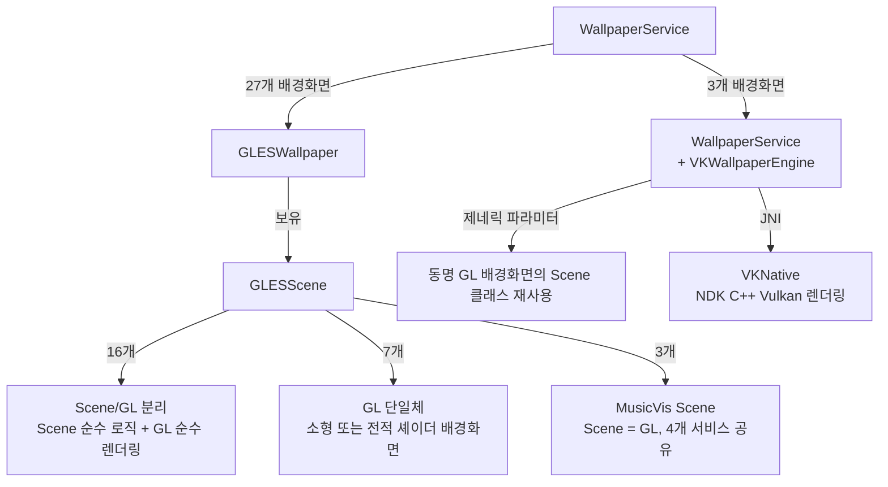

### Scene/GL 분리 패턴

16개 배경화면이 Scene(순수 로직) + GL(순수 렌더링) 분리를 채택:

- **Scene 클래스**: `package-private final class`, 물리 시뮬레이션, 애니메이션 상태, 엔티티 관리를 담당. GL 리소스를 보유하지 않음.
- **GL 클래스**: `public class extends GLESScene`, 셰이더 컴파일, 텍스처 로딩, 드로우 콜을 담당. 비즈니스 로직을 포함하지 않음.

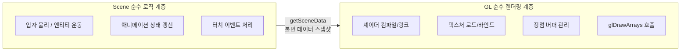

분리된 16개 배경화면: Aurora1, Aurora2, DeepSea, Fall, Fireworks, Galaxy, Galaxy4, Grass, MagicSmoke, Microbes, Nexus, NightSky, Ocean, PhaseBeam, WildWorld, Windmill

7개 GL 단일체 배경화면(BlueSea, HoloSpiral, NoiseField, PolarClock, WalkAround ...)은 코드량이 작거나 셰이더 위주 렌더링에 의존.

### 렌더링 루프

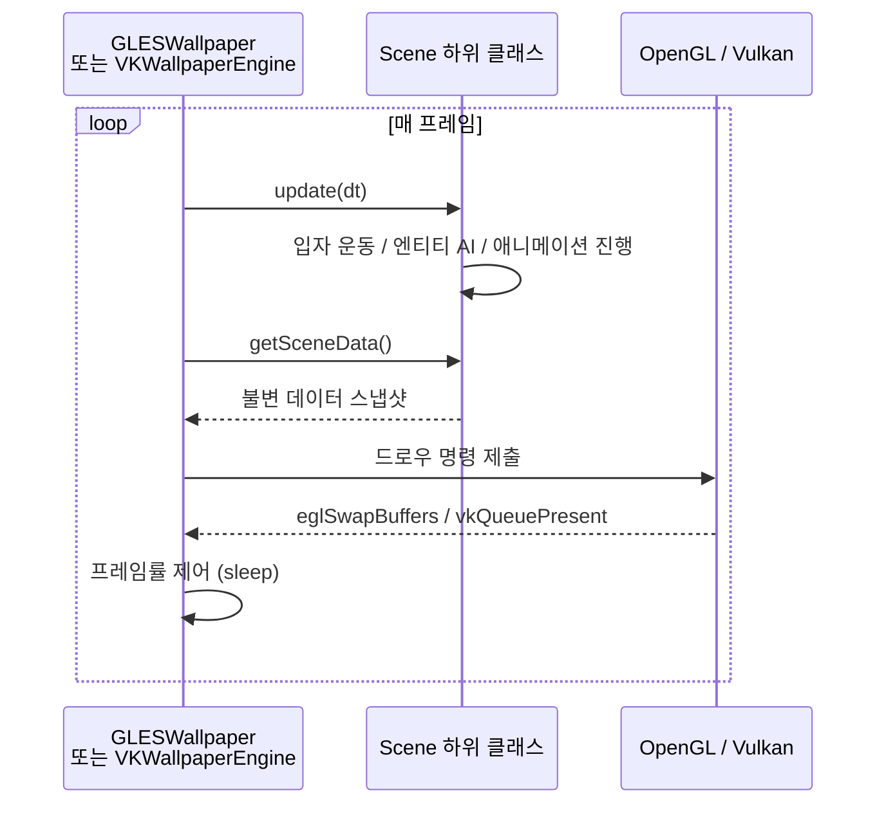

### Vulkan 경로

3개 배경화면(Fall, Galaxy, Grass)이 Vulkan 백엔드 변형을 제공. `VKWallpaperEngine<T>`와 `VKSurfaceView<T>` 제네릭 기반 클래스를 공유:

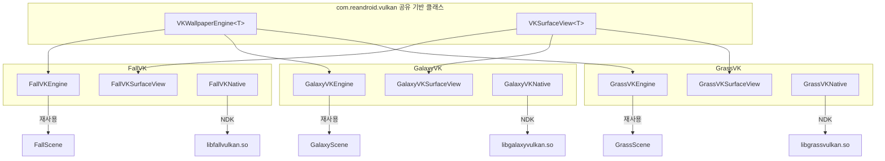

- 기반 클래스는 스레드 관리, Surface 생명주기, 프레임률 진단(ANR 임계값 200ms)을 캡슐화.
- 하위 클래스는 8개 템플릿 메서드(`ensureScene`, `ensureRenderer`, `renderFrame` 등)만 구현.
- 동명의 GL 배경화면이 가진 Scene 순수 로직 클래스를 재사용하므로 시뮬레이션 코드를 다시 작성할 필요 없음.

### 날씨 통합

`WeatherManager`가 비동기적으로 OpenWeatherMap 데이터를 가져옴. Grass, Windmill, Ocean이 하늘, 풀 색상, 구름, 강수, 안개를 동적으로 변경하는 데 사용. 사용자는 직접 API 키를 설정해야 함.

### 설정 시스템

`SettingsActivity` 통합 진입점 → 배경화면 그리드 목록 → 각 `PreferenceFragment`. 실시간 미리보기, 밝기/속도/입자 수 등의 매개변수 조정, 원클릭 기본값 복원(`SettingsResetHelper`) 지원. 전역 프레임률 설정은 모든 배경화면에 적용됨.

## 빌드 구성

### 환경 요구 사항

- Android Studio (최신 안정 버전)
- JDK 17
- Android SDK Platform 33
- Android NDK 25.2.9519653 (프로젝트 고정 버전)
- minSdk 19 / targetSdk 33

### 빌드

```bash
# Debug
./gradlew assembleDebug

# Release (자동 버전 코드 증가)
./gradlew assembleRelease
```

Vulkan 배경화면은 `arm64-v8a`, `armeabi-v7a`, `x86_64`, `x86` 아키텍처가 필요함. NDK 컴파일은 `preBuild` 단계에서 자동 실행됨.

### 프로젝트 구조

```
app/src/main/
├── java/com/reandroid/
│   ├── gles/              GLES 프레임워크 기반
│   ├── vulkan/            Vulkan 프레임워크 기반
│   ├── settings/          설정 UI (Activity + Fragment + 유틸리티)
│   ├── weather/           날씨 데이터 계층
│   └── wallpaper/         모든 배경화면 (하위 패키지별 분류)
├── res/
│   ├── drawable/          524개 텍스처 자산
│   ├── raw/               GLSL 셰이더 + CSV 메시 데이터
│   ├── xml/               배경화면 서비스 선언 + 환경설정 페이지 (각 ~55개)
│   ├── values/            문자열 (12개 언어), 테마, 설정
│   └── layout/            설정 페이지 레이아웃
├── jni/                   Vulkan NDK C++ 소스 (fallvk / galaxyvk / grassvk)
├── jniLibs/               Vulkan .so 산출물
└── shaders/               Vulkan SPIR-V 셰이더 (20개)
```

## 라이선스

[LICENSE](LICENSE) · [NOTICE](NOTICE.md)
